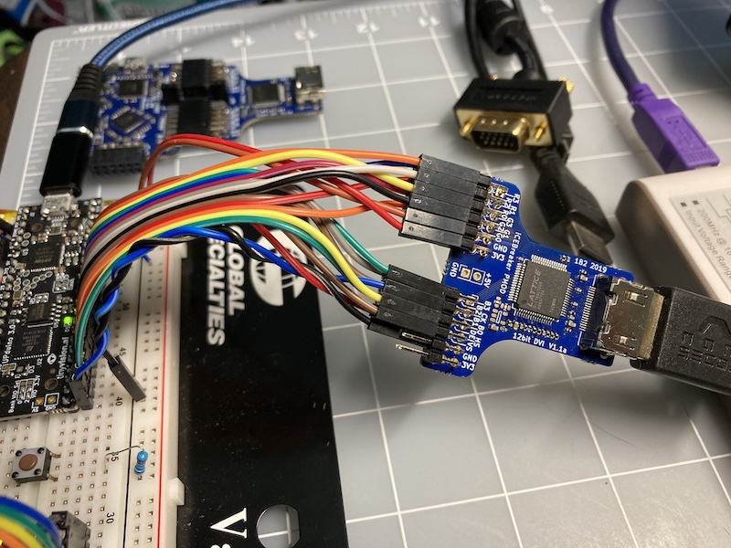

# Building Xosera and Configuration

## ​Tools Needed

Xosera uses the [Yosys/NextPNR​](https://github.com/YosysHQ) open-source FPGA toolchain and is currently targeting the [Lattice iCE40UltraPlus](https://www.latticesemi.com/en/Products/FPGAandCPLD/iCE40UltraPlus) 5K FPGA.  While these tools can all be built from source, I highly recommend the convenient binary releases from the [YosysHQ OSS CAD Suite builds​](https://github.com/YosysHQ/oss-cad-suite-build) and available for Linux (x64, ARM, RV64), MacOS and Windows.  These can be easily used without privileges (just unpack and set your path) and have pretty much all the tools required to synthesize designs for the Lattice iCE40 and ECP5 FPGAs (as well as simulation and a lot more).

I have tested Xosera FPGA bitstream generation successfully on all three OSes.  Under Windows I used [Cygwin64](https://cygwin.com/) shell for GNU "make" and a few other Unix utilities ([MSYS2](https://www.msys2.org/) may also work).

There is also a simple C++ FTDI utility included "host_spi", that can be used to send SPI target commands from the PC via USB FTDI to the Xosera design (for easier testing and development).  It uses the open-source [libftdi](https://www.intra2net.com/en/developer/libftdi/) library​ and can run under Linux, macOS and windows.

## Top-level Makefile Targets

In the top directory of Xosera, there is a "driver" Makefile that has the following targets:

* make all
  * build (almost) everything (RTL, simulation, uitls and host_spi)
* make upduino
  * build Xosera for UPduino v3 (see rtl/upduino.mk for options)
* make upd_prog
  * build Xosera and program UPduino v3 (see rtl/upduino.mk for options)
* make upd_prog
  * build Xosera and program UPduino v3 (see rtl/upduino.mk for options)
* make xosera_vga
  * build full Xosera firmware for rosco_m68k Xosera card for VGA PMOD (combined bitstreams)
* make xosera_dvi
  * build full Xosera firmware for rosco_m68k Xosera card DVI PMOD (combined bitstreams)
* make xosera_vga_prog
  * build and program full Xosera firmware for rosco_m68k Xosera card for VGA PMOD (combined bitstreams for 640x480 and 848x480)
* make xosera_dvi_prog
  * build and program full Xosera firmware for rosco_m68k Xosera card DVI PMOD (combined bitstreams for 640x480 and 848x480)
* make icebreaker
  * build Xosera for iCEBreaker FPGA (see rtl/icebreaker.mk for options)
* make iceb_prog
  * build Xosera and program iCEBreaker (see rtl/icebreaker.mk for options)
* make rtl
  * build both UPduino and iCEBreaker bitstreams
* make sim
  *build Icarus Verilog and Verilalator simulation files
* make isim
  * build Icarus Verilog simulation files
* make irun
  * build and run Icarus Verilog simulation
* make vsim
  * build Verilator C++ & SDL2 native visual simulation files
* make vrun
  * build and run Verilator C++ & SDL2 native visual simulation
* make utils
  * build utilities (currently image_to_mem font converter)
* make host_spi
  * build PC side of FTDI SPI test utility (needs libftdi1)
* make xvid_spi
  * Operate Xosera bus via SPI from PC (needs libftdi1)
* make clean
  * clean files that can be rebuilt

#### Dependencies

* Requires YosysHQ tools.  I recommend using the binaries in the [YosysHQ OSS-CAD-Suite](https://github.com/YosysHQ/oss-cad-suite-build) nightly builds for Linux, MacOS and Windows .  Sadly, brew and distribution versions seem sadly outdated (if you get `TOK_ERROR` or similar, this is likely why).
* Simulation requires Icarus Verilog and/or Verilator (included in YosysHQ OSS-CAD-Suite)
* Utilities and Verilator simulation require a C++ compiler (gcc or clang)
* SDL2 and SDL2_Image required for Verilator visual simulation
* host SPI utilities require libftdi1

On a Ubuntu system, the following packages are needed to be installed (along with the OSS-CAD-Suite or equivalent tools) to build Xosera:
```sudo apt install build-essential unzip libsdl2-dev libsdl2-image-dev libftdi1-dev```

You can consult the most recent `rtl/xosera_upd_stats.txt` or `rtl/xosera_iceb_stats.txt` to see the tool versions I have been using and the design results achieved.  These are submitted to git to make "size and speed" regressions easier to notice (as well as to help others building or modifying Xosera).

<a name="upduino-target"></a>

## UPduino FPGA Target (also used with rosco_m68k Xosera PCB)

​The [UPduino 3.0​](https://github.com/tinyvision-ai-inc/UPduino-v3.0) is a low-cost open-source FPGA iCE40UP5K ​board suitable for breadboards or embedding.

If you are using an UPduino 3.0, then you will need to short the "OSC" jumper so gpio_20 is 12MHz input clock.

UPduino boards require a VGA (or HDMI/DVI) breakout board or breadboard hookup. I have been using a modified Xess StickIt!-VGA (without all pins soldered, as shown [here](https://hackaday.io/project/173731/gallery#8e9ad0d7c922e14d922da6ecdfc4d165)​), but any 3.3V VGA breakout-board should work (up to 4-bits red, green and blue for 4096 colors, but less bits also works).  You can also just wire a VGA connector and a few resistors to make an [R2R DAC](https://en.wikipedia.org/wiki/Resistor_ladder#R%E2%80%932R_resistor_ladder_network_(digital_to_analog_conversion))​ as shown [here](https://papilio.cc/index.php?n=Papilio.ArcadeMegaWing)​ (or [here](https://fraserinnovations.com/fpga-tutor/fpga-beginner-tutorial-vga-experiment-fpga-board-for-beginner-experiment-13/)​ or an 8-color version [here](https://www.fpga4fun.com/PongGame.html)).  For DV (HDMI compatible) video, you can also use the 1BitSquared PMOD with a ribbon-cable "braid" like I have done.   Note that the UPduino Xosera can be synthesized for either VGA or DVI, but this only changes the pinout (the unused pins on the Digilent VGA are repurposed for DVI CK and DE signals).  When synthesized for DVI, it will configure the pins so on an Xosera PCB for rosco_m68k to match the DVI PMOD (it gets confusing - the initial pin choices were for VGA on a breadboard...).

If you can also change the pin mappings used in [rtl/xosera_upd.sv](upduino/xosera_upd.sv).

Included are some test programs for Arduino AVR (pro-mini) that can operate UPduino Xosera.

<a name="icebreaker-target"></a>

## Icebreaker FPGA Target

​The iCEBreaker FPGA​ board is a great little open-source FPGA iCE40UP5K board.  It has three 2x6 PMOD connectors as well as FTDI 2232H JTAG and 16MB of flash.  It is very convenient to use with the PMOD connectors, so typically is my main Xosera development target.

In the "icebreaker" directory is the Makefile to build Xosera for the iCEBreaker FPGA board.  There are several "​​VIDEO_OUTPUT" options for different PMOD display devices, as well as several possible "VIDEO_MODE" settings (see below for VIDEO_MODE settings).

​iCEBreaker VIDEO_OUPUT options include the following for selecting video output device:

* **PMOD_1B2_DVI12** - 12-bit [DVI via HDMI PMOD from 1BitSquared​](https://1bitsquared.com/products/pmod-digital-video-interface) (as shown [here​](https://hackaday.io/project/173731/gallery#0a6102557e8b8c3aa18dedca5f91d63a))
* **​​PMOD_DIGILENT_VGA** - 12-bit [​VGA PMOD from Digilent](https://store.digilentinc.com/pmod-vga-video-graphics-array/)​
* **PMOD_MUSE_VGA** - 12-bit [PMOD-VGA Expansion Board](https://www.tindie.com/products/johnnywu/pmod-vga-expansion-board/)

* **PMOD_XESS_VGA** - 12-bit [StickIt!-​VGA PMOD from Xess](http://www.xess.com/shop/product/stickit-vga/)​ (out of production - but [design is open](https://github.com/xesscorp/StickIt/tree/master/modules/Vga))​
* **PMOD_XESS_VGA_SINGLE** - ​6-bit using a single PMOD from [StickIt!-​VGA PMOD from Xess](http://www.xess.com/shop/product/stickit-vga/)​ (out of production - but [design is open](https://github.com/xesscorp/StickIt/tree/master/modules/Vga))

## RTL Makefile Targets [WIP]

* **all** (default target)
  * builds FPGA bitstream
* **prog**
  * build FPGA bitstream and program board via USB
* **timing**
  * run icetime for timing report (.rpt)
* **count**
  * produce count log showing resources used per module
* **lint**
  * run lint only pass with Verilator
* **show**
  * produce DOT diagrams showing each module graphically
* **clean**
  * deletes all output files that can be rebuilt

[WIP...]
