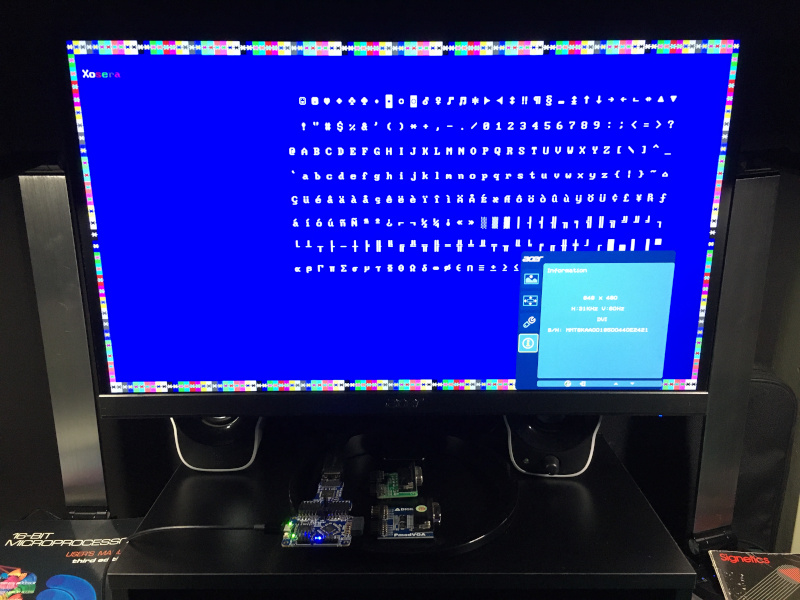

# Xosera - Xark's Open Source Embedded Retro Adapter

## Rosco_m68k PCB board development branch

##### _"Not as clumsy or random as a GPU, an embedded retro video adapter for a more civilized age."_

### Xosera is an FPGA based video adapter designed with the [rosco_m68k](https://github.com/rosco-m68k/rosco_m68k) retro computer in mind (however it is likely adaptable to others)

Inspired in concept by it's "namesake" the [Commander X16](https://www.commanderx16.com/)'s VERA, Xosera is an original open-source video adapter design, built with open-source tools, that is being tailored with features appropriate for a Motorola 68K era retro computer.

Currently the design is supported for the [iCE40UP5K FPGA](https://www.latticesemi.com/en/Products/FPGAandCPLD/iCE40UltraPlus) which is fully supported by the open [Yosys/NextPNR tools](https://github.com/YosysHQ).  Development is being done on both the [iCEBreaker FPGA](https://github.com/icebreaker-fpga/icebreaker) board as well as the [Upduino 3.0](https://github.com/tinyvision-ai-inc/UPduino-v3.0) board (or Upduino 2.x with external oscillator).

This is currently a work in progress, but you can follow along at [Hackaday.io](https://hackaday.io/Xark) or in the [rosco_m68k Discord](https://discord.gg/zGUB7R8) (in the #projects channel).

*NOTE:* This branch is for development of a rosco_m68k Xosera PCB prototype, see [rosco_m68k Hardware Projects feature/xosera branch](https://github.com/rosco-m68k/hardware-projects/tree/feature/xosera) for any details on the hardware development (thanks Ross 😃 ).  During development take everything here but the Verilog code with a grain of salt (i.e., the documentation is out of date - or mostly not written yet).

[See this for information on building and configuring Xosera](BUILDING.md)

Planned Xosera features:

* VGA or HDMI (DVI) output at 640x480@60Hz or 848x480@60Hz (16:9 widescreen 480p) and perhaps 800x600@60Hz
* 16 or 256 color palette out of 4096 colors (12-bit RGB)
* 128KB of embedded video RAM
* Two over-layed "planes" of video
* Character tile based modes with color attribute byte
* Up to 8x16 character size
* 8KB of font RAM
* Smooth horizontal and vertical scrolling
* Bit-mapped 16 and 256 color graphics modes
* "Blitter" to accelerate copy and fill operations
* At least one "cursor" sprite (and likely more)
* Register based interface with auto-increment (as fast as direct mapped)
* SPI interface to registers for development from PC via FTDI (or direct GPIO use)

Current Xosera features:

* VGA and HDMI (DVI) video generation (at resolution fixed at config time)
* 8x16 text with 4-bit foreground/background color per character
* Draws "test image" with prototype-blitter
* SPI target interface with test circuit that allows redefinition of font characters on the fly using C++ host_spi FTDI utility.
* GNU Make based build using the pre-built [FPGA-Toolchain binaries](https://github.com/open-tool-forge/fpga-toolchain) tested on Linux (Ubuntu 20.04), Windows 10 (Cygwin64) and MacOS.
* Fast Verilator simulation including SPI interface and using SDL2 for BMP screenshot of each video frame
* Icarus Verilog simulation (SPI test bench coming)

Features in-progress:

* Finish initial register interface to simple allow read and write from VRAM
* Finish SPI test state-machine to drive register interface "as-if" registers were being directly accessed (just slower over SPI)
* Finish "blitter" memory arbitration work
* Add bit mapped modes

Improvement ideas/TODO items (in no particular order):

* Move palette to BRAM from LUT ROM
* Convert VRAM to 32-bit, or even 64-bit from current 16-bit width to allow more bandwidth per cycle
* Add "pixel double" and "line double" options to get (e.g.) 320x240 with 256 colors
* Consider "pixel shift" options for blitter (for un-aligned drawing)
* Line-draw or polygon acceleration
