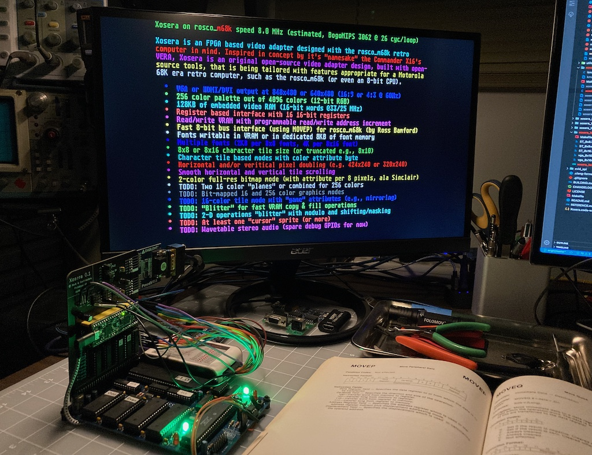

# Xosera - Xark's Open Source Embedded Retro Adapter

##### _"Not as clumsy or random as a GPU, an embedded retro video adapter for a more civilized age."_

### Xosera is an FPGA based video adapter designed with the [rosco_m68k](https://github.com/rosco-m68k/rosco_m68k) retro computer in mind (likely adaptable to most any computer with an 8-bit parallel bus)

Inspired in concept only by it's "namesake" the [Commander X16](https://www.commanderx16.com/)'s VERA, Xosera is an original open-source video adapter design, built with open-source tools, that is being tailored with features appropriate for a Motorola 68K era retro computer.

Currently the design is supported for the [iCE40UP5K FPGA](https://www.latticesemi.com/en/Products/FPGAandCPLD/iCE40UltraPlus) which is fully supported by the open [Yosys/NextPNR tools](https://github.com/YosysHQ).  Development is being done on both the [iCEBreaker FPGA](https://github.com/icebreaker-fpga/icebreaker) board as well as the [UPduino 3.0](https://github.com/tinyvision-ai-inc/UPduino-v3.0) board (or UPduino 2.x with external oscillator).

This is currently a work in progress, but you can follow along at [Hackaday.io](https://hackaday.io/Xark) or in the [rosco_m68k Discord](https://discord.gg/zGUB7R8) (in the #xosera-developers or #xosera-users channel).

*NOTE:* This branch is primarily for development of a rosco_m68k Xosera PCB prototype, see [rosco_m68k Hardware Projects feature/xosera branch](https://github.com/rosco-m68k/hardware-projects/tree/feature/xosera) for any details on the hardware development (thanks Ross 😃 ).  During development take everything here but the Verilog code with a grain of salt (i.e., the documentation is probably out of date - or mostly not written yet).  Feel free to ask in Discord if you have a question.

[See this for information on building and configuring Xosera](BUILDING.md)

Planned Xosera features:

* Two over-layed "planes" of video
* Tile and Bit-mapped 16 and 256 color graphics modes
* "Blitter" to accelerate copy and fill operations
* At least one "cursor" sprite (and likely more)

Current Xosera features:

* VGA or HDMI (DVI) output at 640x480@60Hz or 848x480@60Hz (16:9 widescreen 480p)
* Register based interface with auto-increment (as fast as direct mapped)
* 128KB of embedded video RAM (limited by current modest FPGA)
* Character tile based modes with color attribute byte
* 8x16 text with 4-bit foreground/background color attribute per character
* 2-color hi-res bitmap mode
* 16 or 256 color palette out of 4096 colors (12-bit RGB)
* 8KB of dedicated font RAM (or fonts can be in VRAM)
* Smooth horizontal and vertical tile scrolling
* Amiga-inspired Video-Synchronized Co-processor ("Copper")
* Draws "test image" with prototype-blitter
* Test iCEBreaker target that allows "poking" Xosera bus registers from PC via USB (for testing).
* GNU Make based build using the pre-built [YosysHQ OSS CAD Suite Builds](https://github.com/YosysHQ/oss-cad-suite-build/releases/latest) tested on Linux (Ubuntu 20.04 and also Ubuntu on RPi4 and RISC-V 64), Windows 10 and MacOS.
* Fast Verilator simulation including SPI interface and using SDL2 for PNG screenshot of each video frame
* Icarus Verilog simulation

Features in-progress:

* Improved 4-bit bit mapped modes
* Dual overlaid 4-bit video planes or combined for 8-bit

Improvement ideas/TODO items (in no particular order):

* Convert VRAM to 32-bit from current 16-bit width to allow more bandwidth per cycle
* Consider "pixel shift" options for blitter (for un-aligned drawing)
* Line-draw or polygon acceleration

 Xosera 16-color 640x400 VGA Test

 Early Xosera 848x480 DVI Font Test

Contributors:

* Daniel Cliche (danoidus)
