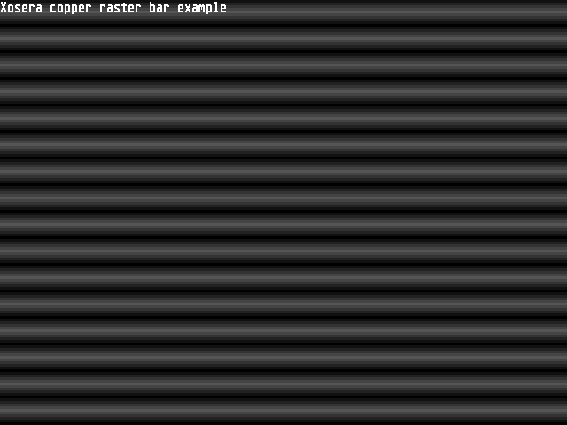

# Xosera - Xark's Open Source Embedded Retro Adapter

Xosera is a Verilog design that implements an audio/video controller (aka Embedded Retro Adapter) providing Amiga-ish level video graphics digital audio capabilities.

The design was originally for iCE40UltraPlus5K FPGAs, but has been ported to other FPGAs (with enough internal memory, like larger ECP5).

It was designed primarily for the rosco_m68K series of 68K based retro computers, but adaptable for other systems (to interface it requires 6 register address signals, an 8-bit bidirectional bus and a couple of control signals). It provides 12-bit RGB color video with text and bitmap modes with dual layers with alpha blending and 4 voice 8-bit digital audio (similar-ish to 80s era 68K home computers).

This document is meant to provide the low-level reference register information to operate it (and should match the Verilog implementation). Please mention it if you spot any discrepency.

**Section Index:**  

- [Xosera - Xark's Open Source Embedded Retro Adapter](#xosera---xarks-open-source-embedded-retro-adapter)
  - [Xosera Reference Information](#xosera-reference-information)
    - [Xosera Main Registers (XM Registers) Summary](#xosera-main-registers-xm-registers-summary)
    - [Xosera Main Register Details (XM Registers)](#xosera-main-register-details-xm-registers)
      - [0x0 **`XM_SYS_CTRL`** (R/W+) - System Control](#0x0-xm_sys_ctrl-rw---system-control)
      - [0x1 **`XM_INT_CTRL`** (R/W+) - Interrupt Control](#0x1-xm_int_ctrl-rw---interrupt-control)
      - [0x2 **`XM_TIMER`** (R/W) - Timer Functions](#0x2-xm_timer-rw---timer-functions)
      - [0x3 **`XM_RD_XADDR`** (R/W+) - XR Read Address](#0x3-xm_rd_xaddr-rw---xr-read-address)
      - [0x4 **`XM_WR_XADDR`** (R/W) - XR Write Address](#0x4-xm_wr_xaddr-rw---xr-write-address)
      - [0x5 **`XM_XDATA`** (R+/W+) - XR Read/Write Data](#0x5-xm_xdata-rw---xr-readwrite-data)
      - [0x6 **`XM_RD_INCR`** (R/W) - Increment for VRAM Read Address](#0x6-xm_rd_incr-rw---increment-for-vram-read-address)
      - [0x7 **`XM_RD_ADDR`** (R/W+) - VRAM Read Address](#0x7-xm_rd_addr-rw---vram-read-address)
      - [0x8 **`XM_WR_INCR`** (R/W) - Increment for VRAM Write Address](#0x8-xm_wr_incr-rw---increment-for-vram-write-address)
      - [0x9 **`XM_WR_ADDR`** (R/W) - VRAM Write Address](#0x9-xm_wr_addr-rw---vram-write-address)
      - [0xA **`XM_DATA`** (R+/W+) - VRAM Read/Write Data](#0xa-xm_data-rw---vram-readwrite-data)
      - [0xB **`XM_DATA_2`** (R+/W+) - VRAM Read/Write Data (2nd)](#0xb-xm_data_2-rw---vram-readwrite-data-2nd)
      - [0xC **`XM_PIXEL_X`** (-/W+) - X coordinate for pixel addr/mask generation (also used to set `PIXEL_BASE`)](#0xc-xm_pixel_x--w---x-coordinate-for-pixel-addrmask-generation-also-used-to-set-pixel_base)
      - [0xD **`PIXEL_Y`** (-/W+) - Y coordinate for pixel addr/mask generation (also used to set `PIXEL_WIDTH`)](#0xd-pixel_y--w---y-coordinate-for-pixel-addrmask-generation-also-used-to-set-pixel_width)
      - [0xE **`XM_UART`** (R+/W+)](#0xe-xm_uart-rw)
      - [0xF **`XM_FEATURE`** (R/-) - Xosera feature bits](#0xf-xm_feature-r----xosera-feature-bits)
  - [Xosera Extended Register / Extended Memory Region Summary](#xosera-extended-register--extended-memory-region-summary)
    - [Xosera Extended Registers Details (XR Registers)](#xosera-extended-registers-details-xr-registers)
    - [Video Config and Copper XR Registers Summary](#video-config-and-copper-xr-registers-summary)
    - [Video Config and Copper XR Registers Details](#video-config-and-copper-xr-registers-details)
      - [0x00 **`XR_VID_CTRL`** (R/W) - Border Color / Playfield Color-Swap](#0x00-xr_vid_ctrl-rw---border-color--playfield-color-swap)
      - [0x01 **`XR_COPP_CTRL`** (R/W) - Copper Enable](#0x01-xr_copp_ctrl-rw---copper-enable)
      - [0x02 **`XR_AUD_CTRL`** (R/W) - Audio Control](#0x02-xr_aud_ctrl-rw---audio-control)
      - [0x03 **`XR_SCANLINE`** (R/W+) - current video scan line/trigger Xosera host CPU video interrupt](#0x03-xr_scanline-rw---current-video-scan-linetrigger-xosera-host-cpu-video-interrupt)
      - [0x04 **`XR_VID_LEFT`** (R/W) - video display window left edge](#0x04-xr_vid_left-rw---video-display-window-left-edge)
      - [0x05 **`XR_VID_RIGHT`** (R/W) - video display window right edge](#0x05-xr_vid_right-rw---video-display-window-right-edge)
      - [0x06 **`XR_POINTER_H`** (-/W+) - pointer sprite H position](#0x06-xr_pointer_h--w---pointer-sprite-h-position)
      - [0x07 **`XR_POINTER_V`** (-/W+) - pointer sprite V position and colormap select](#0x07-xr_pointer_v--w---pointer-sprite-v-position-and-colormap-select)
    - [Playfield A \& B Control XR Registers Summary](#playfield-a--b-control-xr-registers-summary)
    - [Playfield A \& B Control XR Registers Details](#playfield-a--b-control-xr-registers-details)
      - [0x10 **`XR_PA_GFX_CTRL` (R/W)** - playfield A (base) graphics control](#0x10-xr_pa_gfx_ctrl-rw---playfield-a-base-graphics-control)
      - [0x18 **`XR_PB_GFX_CTRL` (R/W)** - playfield B (overlay) graphics control](#0x18-xr_pb_gfx_ctrl-rw---playfield-b-overlay-graphics-control)
      - [0x11 **`XR_PA_TILE_CTRL` (R/W)** - playfield A (base) tile control](#0x11-xr_pa_tile_ctrl-rw---playfield-a-base-tile-control)
      - [0x19 **`XR_PB_TILE_CTRL` (R/W)** - playfield B (overlay) tile control](#0x19-xr_pb_tile_ctrl-rw---playfield-b-overlay-tile-control)
      - [0x12 **`XR_PA_DISP_ADDR` (R/W)** - playfield A (base) display VRAM start address](#0x12-xr_pa_disp_addr-rw---playfield-a-base-display-vram-start-address)
      - [0x1A **`XR_PB_DISP_ADDR` (R/W)** - playfield B (overlay) display VRAM start address](#0x1a-xr_pb_disp_addr-rw---playfield-b-overlay-display-vram-start-address)
      - [0x13 **`XR_PA_LINE_LEN` (R/W)** - playfield A (base) display line word length](#0x13-xr_pa_line_len-rw---playfield-a-base-display-line-word-length)
      - [0x1B **`XR_PB_LINE_LEN` (R/W)** - playfield B (overlay) display line word length](#0x1b-xr_pb_line_len-rw---playfield-b-overlay-display-line-word-length)
      - [0x14 **`XR_PA_HV_FSCALE` (R/W)** - playfield A (base) horizontal and vertical fractional scale](#0x14-xr_pa_hv_fscale-rw---playfield-a-base-horizontal-and-vertical-fractional-scale)
      - [0x1C **`XR_PB_HV_FSCALE` (R/W)** - playfield B (overlay) horizontal and vertical fractional scale](#0x1c-xr_pb_hv_fscale-rw---playfield-b-overlay-horizontal-and-vertical-fractional-scale)
      - [0x15 **`XR_PA_H_SCROLL` (R/W)** - playfield A (base) horizontal fine scroll](#0x15-xr_pa_h_scroll-rw---playfield-a-base-horizontal-fine-scroll)
      - [0x1D **`XR_PB_H_SCROLL` (R/W)** - playfield B (overlay) horizontal fine scroll](#0x1d-xr_pb_h_scroll-rw---playfield-b-overlay-horizontal-fine-scroll)
      - [0x16 **`XR_PA_V_SCROLL` (R/W)** - playfield A (base) vertical repeat and tile fine scroll](#0x16-xr_pa_v_scroll-rw---playfield-a-base-vertical-repeat-and-tile-fine-scroll)
      - [0x1E **`XR_PB_V_SCROLL` (R/W)** - playfield B (overlay) vertical repeat and tile fine scroll](#0x1e-xr_pb_v_scroll-rw---playfield-b-overlay-vertical-repeat-and-tile-fine-scroll)
      - [0x17 **`XR_PA_LINE_ADDR` (WO)** - playfield A (base) display VRAM next line address](#0x17-xr_pa_line_addr-wo---playfield-a-base-display-vram-next-line-address)
      - [0x1F **`XR_PB_LINE_ADDR` (WO)** - playfield B (overlay) display VRAM next line address](#0x1f-xr_pb_line_addr-wo---playfield-b-overlay-display-vram-next-line-address)
    - [Bitmap Display Formats](#bitmap-display-formats)
    - [Tile Display Formats](#tile-display-formats)
    - [Final Color Index Selection](#final-color-index-selection)
    - [Color Memory ARGB Look-up and Playfield Blending](#color-memory-argb-look-up-and-playfield-blending)
      - [`COLOR_A` and `COLOR_B` colormap format](#color_a-and-color_b-colormap-format)
    - [Sample Based Audio Generation](#sample-based-audio-generation)
      - [Audio Generation XR Registers Summary](#audio-generation-xr-registers-summary)
      - [Audio Generation XR Registers Details](#audio-generation-xr-registers-details)
        - [0x20 **`XR_AUD0_VOL` (-/W)** - audio channel 0 left/right mix volume](#0x20-xr_aud0_vol--w---audio-channel-0-leftright-mix-volume)
        - [0x24 **`XR_AUD1_VOL` (-/W)** - audio channel 1 left/right mix volume](#0x24-xr_aud1_vol--w---audio-channel-1-leftright-mix-volume)
        - [0x28 **`XR_AUD2_VOL` (-/W)** - audio channel 2 left/right mix volume](#0x28-xr_aud2_vol--w---audio-channel-2-leftright-mix-volume)
        - [0x2C **`XR_AUD3_VOL` (-/W)** - audio channel 3 left/right mix volume](#0x2c-xr_aud3_vol--w---audio-channel-3-leftright-mix-volume)
        - [0x21 **`XR_AUD0_PERIOD` (-/W)** - audio channel 0 sample period](#0x21-xr_aud0_period--w---audio-channel-0-sample-period)
        - [0x25 **`XR_AUD1_PERIOD` (-/W)** - audio channel 1 sample period](#0x25-xr_aud1_period--w---audio-channel-1-sample-period)
        - [0x29 **`XR_AUD2_PERIOD` (-/W)** - audio channel 2 sample period](#0x29-xr_aud2_period--w---audio-channel-2-sample-period)
        - [0x2D **`XR_AUD3_PERIOD` (-/W)** - audio channel 3 sample period](#0x2d-xr_aud3_period--w---audio-channel-3-sample-period)
        - [0x22 **`XR_AUD0_LENGTH` (-/W)** - audio channel 0 sample word length and VRAM/TILE memory](#0x22-xr_aud0_length--w---audio-channel-0-sample-word-length-and-vramtile-memory)
        - [0x26 **`XR_AUD1_LENGTH` (-/W)** - audio channel 1 sample word length and VRAM/TILE memory](#0x26-xr_aud1_length--w---audio-channel-1-sample-word-length-and-vramtile-memory)
        - [0x2A **`XR_AUD2_LENGTH` (-/W)** - audio channel 2 sample word length and VRAM/TILE memory](#0x2a-xr_aud2_length--w---audio-channel-2-sample-word-length-and-vramtile-memory)
        - [0x2E **`XR_AUD3_LENGTH` (-/W)** - audio channel 3 sample word length and VRAM/TILE memory](#0x2e-xr_aud3_length--w---audio-channel-3-sample-word-length-and-vramtile-memory)
        - [0x23 **`XR_AUD0_START` (-/W)** - audio channel 0 sample start address (in either VRAM/TILE)](#0x23-xr_aud0_start--w---audio-channel-0-sample-start-address-in-either-vramtile)
        - [0x27 **`XR_AUD1_START` (-/W)** - audio channel 1 sample start address (in either VRAM/TILE)](#0x27-xr_aud1_start--w---audio-channel-1-sample-start-address-in-either-vramtile)
        - [0x2B **`XR_AUD2_START` (-/W)** - audio channel 2 sample start address (in either VRAM/TILE)](#0x2b-xr_aud2_start--w---audio-channel-2-sample-start-address-in-either-vramtile)
        - [0x2F **`XR_AUD3_START` (-/W)** - audio channel 3 sample start address (in either VRAM/TILE)](#0x2f-xr_aud3_start--w---audio-channel-3-sample-start-address-in-either-vramtile)
    - [2D Blitter Engine Operation](#2d-blitter-engine-operation)
      - [Logic Operation Applied to Blitter Operations](#logic-operation-applied-to-blitter-operations)
      - [Transparency Testing and Masking Applied to Blitter Operations](#transparency-testing-and-masking-applied-to-blitter-operations)
      - [Nibble Shifting and First/Last Word Edge Masking](#nibble-shifting-and-firstlast-word-edge-masking)
      - [Blitter Operation Status](#blitter-operation-status)
    - [2D Blitter Engine XR Registers Summary](#2d-blitter-engine-xr-registers-summary)
      - [2D Blitter Engine XR Registers Details](#2d-blitter-engine-xr-registers-details)
        - [0x40 **`XR_BLIT_CTRL` (-/W)** - control bits (transparency control, S const)](#0x40-xr_blit_ctrl--w---control-bits-transparency-control-s-const)
        - [0x41 **`XR_BLIT_ANDC` (-/W)** - source term ANDC value constant](#0x41-xr_blit_andc--w---source-term-andc-value-constant)
        - [0x42 **`XR_BLIT_XOR` (-/W)** - source term XOR value constant](#0x42-xr_blit_xor--w---source-term-xor-value-constant)
        - [0x43 **`XR_BLIT_MOD_S` (-/W)** - modulo added to `BLIT_SRC_S` address at end of line](#0x43-xr_blit_mod_s--w---modulo-added-to-blit_src_s-address-at-end-of-line)
        - [0x44 **`XR_BLIT_SRC_S` (-/W)** - source `S` term (read from VRAM address or constant value)](#0x44-xr_blit_src_s--w---source-s-term-read-from-vram-address-or-constant-value)
        - [0x45 **`XR_BLIT_MOD_D` (-/W)** - modulo added to `BLIT_DST_D` address at end of line](#0x45-xr_blit_mod_d--w---modulo-added-to-blit_dst_d-address-at-end-of-line)
        - [0x46 **`XR_BLIT_DST_D` (-/W)** - destination `D` VRAM write address](#0x46-xr_blit_dst_d--w---destination-d-vram-write-address)
        - [0x47 **`XR_BLIT_SHIFT` (-/W)** - first and last word nibble masks and nibble shift](#0x47-xr_blit_shift--w---first-and-last-word-nibble-masks-and-nibble-shift)
        - [0x48 **`XR_BLIT_LINES` (-/W)** - 15-bit number of lines high - 1 (1 to 32768)](#0x48-xr_blit_lines--w---15-bit-number-of-lines-high---1-1-to-32768)
        - [0x49 **`XR_BLIT_WORDS` (-/W+)** - write queues operation, word width - 1 (1 to 65536, repeats `XR_BLIT_LINES` times)](#0x49-xr_blit_words--w---write-queues-operation-word-width---1-1-to-65536-repeats-xr_blit_lines-times)
  - [Video Synchronized Co-Processor "Copper" Details](#video-synchronized-co-processor-copper-details)
    - [Programming the Copper](#programming-the-copper)
    - [Copper Instruction Set](#copper-instruction-set)
      - [Copper Pseudo Instructions (when using CopAsm, or C macros)](#copper-pseudo-instructions-when-using-copasm-or-c-macros)
      - [Notes on Copper Memory Access](#notes-on-copper-memory-access)
    - [Copper Assembler CopAsm](#copper-assembler-copasm)
      - [Copper Assembler Examples](#copper-assembler-examples)
    - [Default TILE, COLOR and COPPER Memory Contents](#default-tile-color-and-copper-memory-contents)

## Xosera Reference Information

Xosera uses an 8-bit parallel bus with 4 bits to select from one of 16 main 16-bit bus accessable registers (and a bit to select the even or odd register half, using 68000 big-endian convention of high byte at even addresses). Since Xosera uses an 8-bit bus, for low-level access on 68K systems multi-byte operations can utilize the `MOVEP.W` or `MOVEP.L` instructions that skip the unused half of the 16-bit data word (also known as a 8-bit "6800" style peripheral bus). When this document mentions, for example "writing a word", it means writing to the even and then odd bytes of a register (usually with `MOVE.P` but multiple `MOVE.B` instructions work also). For some registers there is a "special action" that happens on a 16-bit word when the odd (low byte) is either read or written (generally noted).

Xosera's 128KB of VRAM is organized as 64K x 16-bit words, so a full VRAM address is 16-bits (and an individual byte is not directly accessible, only 16-bit words, however write "nibble masking" is available).

In addition to the main registers and VRAM, there is an additional extended register / memory XR bus that provides access to control registers for system control, video configuration, drawing engines and display co-processor as well as additional memory regions for tile definitions, audio waveforms, color look-up and display coprocessor instructions.

___

### Xosera Main Registers (XM Registers) Summary

| Reg # | Reg Name          | Access | Description                                                                           |
|-------|-------------------|--------|---------------------------------------------------------------------------------------|
| 0x0   | **`XM_SYS_CTRL`** | R /W+  | Status flags, write to [15:8] inits `PIXEL_X/Y`, [3:0] VRAM write nibble mask         |
| 0x1   | **`XM_INT_CTRL`** | R /W+  | FPGA reconfigure, interrupt masking, interrupt status                                 |
| 0x2   | **`XM_TIMER`**    | R /W+  | Read 16-bit tenth millisecond timer (1/10,000 second), write 8-bit interval timer     |
| 0x3   | **`XM_RD_XADDR`** | R /W+  | XR register/address used for `XM_XDATA` read access                                   |
| 0x4   | **`XM_WR_XADDR`** | R /W   | XR register/address used for `XM_XDATA` write access                                  |
| 0x5   | **`XM_XDATA`**    | R+/W+  | Read from `XM_RD_XADDR` or write to `XM_WR_XADDR` (and increment address by 1)        |
| 0x6   | **`XM_RD_INCR`**  | R /W   | increment value for `XM_RD_ADDR` read from `XM_DATA`/`XM_DATA_2`                      |
| 0x7   | **`XM_RD_ADDR`**  | R /W+  | VRAM address for reading from VRAM when `XM_DATA`/`XM_DATA_2` is read                 |
| 0x8   | **`XM_WR_INCR`**  | R /W   | increment value for `XM_WR_ADDR` on write to `XM_DATA`/`XM_DATA_2`                    |
| 0x9   | **`XM_WR_ADDR`**  | R /W   | VRAM address for writing to VRAM when `XM_DATA`/`XM_DATA_2` is written                |
| 0xA   | **`XM_DATA`**     | R+/W+  | read/write VRAM word at `XM_RD_ADDR`/`XM_WR_ADDR` (and add `XM_RD_INCR`/`XM_WR_INCR`) |
| 0xB   | **`XM_DATA_2`**   | R+/W+  | 2<sup>nd</sup> `XM_DATA`(to allow for 32-bit read/write access)                       |
| 0xC   | **`XM_PIXEL_X`**  | - /W+  | X pixel sets `WR_ADDR` and nibble mask (also `PIXEL_BASE` for `XM_SYS_CTRL` write)    |
| 0xD   | **`XM_PIXEL_Y`**  | - /W+  | Y pixel sets `WR_ADDR` and nibble mask (also `PIXEL_WIDTH` for `XM_SYS_CTRL` write)   |
| 0xE   | **`XM_UART`**     | R+/W+  | USB UART using FTDI chip in UPduino for additional 1 Mbps USB connection to PC *[1]*  |
| 0xF   | **`XM_FEATURE`**  | R /-   | Feature bits                                                                          |

(`R+` or `W+` indicates that reading or writing this register can have additional "side effects", respectively)
*[1]* USB UART is an optional debug convenience feature, since FTDI chip was present on UPduino.  It may not always be present.
___

### Xosera Main Register Details (XM Registers)

##### 0x0 **`XM_SYS_CTRL`** (R/W+) - System Control


**Status bits for memory, blitter, hblank, vblank, `PIXEL_X/Y` setup and VRAM nibble write masking**

| Name          | Bits    | R/W  | Description                                                                     |
|---------------|---------|------|---------------------------------------------------------------------------------|
| `MEM_WAIT`    | `[15]`  | R/-  | memory read/write operation still in progress (for contended memory)            |
| `BLIT_FULL`   | `[14]`  | R/-  | blit queue full (can't safely write to blit registers when set)                 |
| `BLIT_BUSY`   | `[13]`  | R/-  | blit busy (blit operations not fully completed, but queue may be empty)         |
| `HBLANK`      | `[11]`  | R/-  | horizontal blank flag (i.e., current pixel is not visible, off left/right edge) |
| `VBLANK`      | `[10]`  | R/-  | vertical blank flag (i.e., current line is not visible, off top/bottom edge)    |
| `PIX_NO_MASK` | `[9]`   | R/W+ | `XM_PIXEL_X/Y` won't set `WR_MASK` (low two bits of `PIXEL_X` ignored)          |
| `PIX_8B_MASK` | `[8]`   | R/W+ | `XM_PIXEL_X/Y` 8-bit pixel mask for WR_MASK (on even 4-BPP coordinates)         |
| `WR_MASK`     | `[3:0]` | R/W  | `XM_DATA`/`XM_DATA_2` VRAM nibble write mask (see below)                        |

When bits `[15:8]` (even/upper byte) of `XM_SYS_CTRL` are written, besides setting`XM_PIXEL_X/Y` address generation options `PIX_NO_MASK` and `PIX_8B_MASK`, it also will initialize the internal registers `PIXEL_BASE` (base VRAM address) and `PIXEL_WIDTH` (width of line in words). `XM_PIXEL_X` will be copied into `PIXEL_BASE` and `XM_PIXEL_Y` into `PIXEL_WIDTH` (so generally they should be set before writing bits `[15:8]`).

> :mag: **`PIX_8B_MASK`** The X coordinate of `XM_PIXEL_X` assumes 4-bit pixels, but if `PIX_8B_MASK` is enabled in `SYS_CTRL`, then mask will be set for 2 nibbles (8-bits) on even coordinates for easy use with 8-bit pixels.

> :mag: **`PIX_NO_MASK`** If `PIX_NO_MASK` is enabled in `XM_SYS_CTRL`, then when writing to `XM_PIXEL_X` or `XM_PIXEL_Y` it will only update `WR_ADDR` and not the `XM_SYS_CTRL` nibble write mask.  This is useful to allow writing the entire VRAM word.  This will make the lower two bits of `XM_PIXEL_X` effectively ignored.

> :mag: **VRAM write mask:**  When a bit corresponding to a given nibble is zero, writes to that nibble are ignored and the original nibble is retained. For example, if the nibble mask is `0010` then only bits `[7:4]` in a word would be over-written writing to VRAM via `XM_DATA`/`XM_DATA_2` (other nibbles will be unmodified).  This can be useful to isolate pixels within a word of VRAM (without needing read, modify, write).  This can also be set automatically by `XM_PIXEL_X/Y` (to isolate a specific 4-bit or 8-bit pixel via X, Y coordinate).

##### 0x1 **`XM_INT_CTRL`** (R/W+) - Interrupt Control

  

**FPGA reconfigure, interrupt masking and interrupt status.**

| Name         | Bits   | R/W  | Description                                                       |
|--------------|--------|------|-------------------------------------------------------------------|
| `RECONFIG`   | `[15]` | -/W+ | Reconfigure FPGA with `INT_CTRL[9:8]` as new configuration number |
| `BLIT_EN`    | `[14]` | R/W  | enable interrupt for blitter queue empty                          |
| `TIMER_EN`   | `[13]` | R/W  | enable interrupt for countdown timer                              |
| `VIDEO_EN`   | `[12]` | R/W  | enable interrupt for video (vblank/COPPER)                        |
| `AUD3_EN`    | `[11]` | R/W  | enable interrupt for audio channel 3 ready                        |
| `AUD2_EN`    | `[10]` | R/W  | enable interrupt for audio channel 2 ready                        |
| `AUD1_EN`    | `[9]`  | R/W  | enable interrupt for audio channel 1 ready                        |
| `AUD0_EN`    | `[8]`  | R/W  | enable interrupt for audio channel 0 ready                        |
|              | `[7]`  | R/-  | unused (reads as 0)                                               |
| `BLIT_INTR`  | `[6]`  | R/W  | interrupt pending for blitter queue empty                         |
| `TIMER_INTR` | `[5]`  | R/W  | interrupt pending for countdown timer                             |
| `VIDEO_INTR` | `[4]`  | R/W  | interrupt pending for video (vblank/COPPER)                       |
| `AUD3_INTR`  | `[3]`  | R/W  | interrupt pending for audio channel 3 ready                       |
| `AUD2_INTR`  | `[2]`  | R/W  | interrupt pending for audio channel 2 ready                       |
| `AUD1_INTR`  | `[1]`  | R/W  | interrupt pending for audio channel 1 ready                       |
| `AUD0_INTR`  | `[0]`  | R/W  | interrupt pending for audio channel 0 ready                       |

> :mag: **Xosera Reconfig:** Writing a 1 to bit `XM_INT_CTRL[15]` will immediately reset and reconfigure the Xosera FPGA into one of four FPGA configurations stored in flash memory selected with bits `XM_INT_CTRL[9:8]` (in same byte).  Normally, default config #0 is standard VGA 640x480 and config #1 is wide-screen 848x480  (the other configurations are user defined and it will fall back to config #0 on missing or invalid configurations). Reconfiguration can take up to 100ms and during this period Xosera will be unresponsive (and no display will be generated, so monitor will blank).  All register settings, VRAM, TILEMEM and other memory on Xosera will be reset and restored to defaults.

##### 0x2 **`XM_TIMER`** (R/W) - Timer Functions


**Tenth millisecond timer / 8-bit countdown timer.**  

**Read 16-bit timer, increments every 1/10<sup>th</sup> of a millisecond (10,000 Hz)**  
Can be used for fairly accurate timing. Internal fractional value is maintined (so as accurate as FPGA clock).  Can be used for elapsed time up to ~6.5 seconds (or unlimited, if the cumulative elapsed time is updated at least as often as timer wrap value).

> :mag: **`XM_TIMER` atomic read:** To ensure an atomic 16-bit value, when the high byte of `TIMER` is read, the low byte is saved into an internal register and returned when `XM_TIMER` low byte is read. Because of this, reading the full 16-bit `TIMER` register is recommended (or first even byte, then odd byte, or odd byte value may not be updated).

**Write to set 8-bit countdown timer interval**  
When written, the lower 8 bits sets a write-only 8-bit countdown timer interval.  Timer is decremented every 1/10<sup>th</sup>  millisecond and when timer reaches zero an Xosera timer interrupt (`TIMER_INTR`) will be generated and the count will be reset.  This register setting has no effect on the `XM_TIMER` read (only uses same 1/10<sup>th</sup> ms time-base).

> :mag: **8-bit countdown timer** interval can only be written (as a read will return the free running `XM_TIMER` value).  It is only useful to generate an interrupt (or polling bit in `XM_INT_CTRL`)

##### 0x3 **`XM_RD_XADDR`** (R/W+) - XR Read Address


 **XR Register / Memory Read Address**

**Extended register or memory address for data *read* via `XM_XDATA`**  
Specifies the XR register or XR region address to be read or written via `XM_XDATA`.  As soon as this register is written, a 16-bit read operation will take place on the register or memory region specified (and the data wil be made available from `XM_XDATA`).

##### 0x4 **`XM_WR_XADDR`** (R/W) - XR Write Address


**XR Register / Memory Write Address for data *written* to `XM_XDATA`**  
Specifies the XR register or XR region address to be accessed via `XM_XDATA`.  
The register ordering with `XM_WR_XADDR` followed by `XM_XDATA` allows a 32-bit write to set both the XR register/address `rrrr`  and the immediate word value `NNNN`, similar to:  

```text
MOVE.L #$rrrrNNNN,D0
MOVEP.L D0,XR_WR_XADDR(A1)
```

##### 0x5 **`XM_XDATA`** (R+/W+) - XR Read/Write Data


**XR Register / Memory Read Data or Write Data**  
Read XR register/memory value from `XM_RD_XADDR` or write value to `XM_WR_XADDR` and increment `XM_RD_XADDR`/`XM_WR_XADDR`, respectively.  
When `XM_XDATA` is read, data pre-read from XR address `XM_RD_XADDR` is returned and then `XM_RD_XADDR` is incremented by one and pre-reading the next word begins.  
When `XM_XDATA` is written, value is written to XR address `XM_WR_XADDR` and then `XM_WR_XADDR` is incremented by one.

##### 0x6 **`XM_RD_INCR`** (R/W) - Increment for VRAM Read Address


**Increment value for `XM_RD_ADDR` when `XM_DATA`/`XM_DATA_2` is read from**  
Twos-complement value added to `XM_RD_ADDR` address when `XM_DATA` or `XM_DATA_2` is read from.  
Allows quickly reading Xosera VRAM from `XM_DATA`/`XM_DATA_2` when using a fixed increment.

> :mag: **32-bit access:** Xosera treats 32-bit long access (e.g. `MOVEP.L` from `XM_DATA`) as two 16-bit accesses, so the increment would be the same as with 16-bit word access (but it will be applied twice, once for `XM_DATA` and once for `XM_DATA_2`).

##### 0x7 **`XM_RD_ADDR`** (R/W+) - VRAM Read Address


**VRAM *read* address for `XM_DATA`/`XM_DATA_2`**  
VRAM address that will be read when `XM_DATA` or `XM_DATA_2` register is read from.
When `XM_RD_ADDR` is written (or when auto incremented) the corresponding word in VRAM is pre-read and made
available at `XM_DATA`/`XM_DATA_2`.

##### 0x8 **`XM_WR_INCR`** (R/W) - Increment for VRAM Write Address


**Increment value for `XM_WR_ADDR` when `XM_DATA`/`XM_DATA_2` is written.**  
Twos-complement value added to `XM_WR_ADDR` when `XM_DATA` or `XM_DATA_2` is written to.  
Allows quickly writing to Xosera VRAM via `XM_DATA`/`XM_DATA_2` when using a fixed increment.

> :mag: **32-bit access:** Xosera treats 32-bit long access (e.g. `MOVEP.L` to `XM_DATA`) as two 16-bit accesses, so the increment would be the same as with 16-bit word access (but it will be applied twice, once for `XM_DATA` and once for `XM_DATA_2`).

##### 0x9 **`XM_WR_ADDR`** (R/W) - VRAM Write Address


 **VRAM *write* address for `XM_DATA`/`XM_DATA_2`**  
Specifies VRAM address used when writing to VRAM via `XM_DATA`/`XM_DATA_2`. Writing a value here does not cause any VRAM access (which happens when data *written* to `XM_DATA` or `XM_DATA_2`).

##### 0xA **`XM_DATA`** (R+/W+) - VRAM Read/Write Data


**VRAM memory value *read* from `XM_RD_ADDR` or value to *write* to `XM_WR_ADDR`**  
When `XM_DATA` is read, data from VRAM at `XM_RD_ADDR` is returned and `XM_RD_INCR` is added to `XM_RD_ADDR` and pre-reading the new VRAM address begins.  
When `XM_DATA` is written, the value is written to VRAM at `XM_WR_ADDR` and `XM_WR_INCR` is added to `XM_WR_ADDR`.

##### 0xB **`XM_DATA_2`** (R+/W+) - VRAM Read/Write Data (2<sup>nd</sup>)


**VRAM memory value *read* from `XM_RD_ADDR` or value to *write* to `XM_WR_ADDR`**  
When `XM_DATA_2` is read, data from VRAM at `XM_RD_ADDR` is returned and `XM_RD_INCR` is added to `XM_RD_ADDR` and pre-reading the new VRAM address begins.  
When `XM_DATA_2` is written, the value is written to VRAM at `XM_WR_ADDR` and `XM_WR_INCR` is added to `XM_WR_ADDR`.

> :mag: **`XM_DATA_2`** This register is treated *identically* to `XM_DATA` and is intended to allow for two back-to-back 16-bit transfers to/from `XM_DATA` by using 32-bit `MOVEP.L` instruction (for additional transfer speed).

##### 0xC **`XM_PIXEL_X`** (-/W+) - X coordinate for pixel addr/mask generation (also used to set `PIXEL_BASE`)


**signed X coordinate for pixel addressing, write sets `XM_WR_ADDR` and `XM_SYS_CTRL[3:0]`/`WR_MASK` nibble mask to isolate pixel**

Used to allow using pixel coordinates to calculate VRAM write address and also isolate a specific 4-bit or 8-bit pixel bits to update. Upon write, sets:  
 `XM_WR_ADDR = PIXEL_BASE + (XM_PIXEL_Y * PIXEL_WIDTH) + (XM_PIXEL_X >> 2)`  
 Also sets `XM_SYS_CTRL[3:0]`/`WR_MASK` nibble write mask (unless `XM_SYS_CTRL[9]`/`PIX_NO_MASK` set) to binary:  
 `1p00 >> PIXEL_X[1:0]` (`p` is `0` for 4-BPP or `1` for 8-BPP on even X coordinates when `XM_SYS_CTRL[9]`/`PIX_8B_MASK` set).  

 The value in this register is also used to set the `PIXEL_BASE` internal register when `XM_SYS_CTRL[15:8]` is written to (see `SYS_CTRL`).  Generally this needs to be done before using the pixel address generation feature.

> :mag: **`XM_WR_ADDR` and `XM_SYS_CTRL[3:0]`/`WR_MASK`** These registers will generally be altered immediately whenever this register is altered, keep this in mind (especially it is easy to unintentionally alter the write mask, causing issues later with garbed writes to VRAM if it is not restored to `0xF`).  Also `XM_SYS_CTRL[8]`/`PIX_NO_MASK` set will prevent the mask from being altered.

##### 0xD **`PIXEL_Y`** (-/W+) - Y coordinate for pixel addr/mask generation (also used to set `PIXEL_WIDTH`)


**signed Y coordinate for pixel addressing, write sets `WR_ADDR` and `SYS_CTRL` `WR_MASK` nibble mask to isolate pixel**

Used to allow using pixel coordinates to calculate VRAM write address and also isolate a specific 4-bit or 8-bit pixel to update. Upon write, sets:  
 `WR_ADDR = PIXEL_BASE + (PIXEL_Y * PIXEL_WIDTH) + (PIXEL_X >> 2)`  
 Also sets `XM_SYS_CTRL[3:0]`/`WR_MASK` nibble write mask (unless `XM_SYS_CTRL[9]`/`PIX_NO_MASK` set) to binary:  
 `1p00 >> PIXEL_X[1:0]` (`p` is `0` for 4-BPP or `1` for 8-BPP on even X coordinates when `XM_SYS_CTRL[9]`/`PIX_8B_MASK` set).

The value in this register is also used to set `PIXEL_WIDTH` when `SYS_CTRL[15:8]` is written to (see `XM_SYS_CTRL`).  Generally this needs to be done before using the pixel address generation feature.

> :mag: **`XM_WR_ADDR` and `XM_SYS_CTRL[3:0]`/`WR_MASK`** These registers will generally be altered immediately whenever this register is altered, keep this in mind (especially it is easy to unintentionally alter the write mask, causing issues later with garbed writes to VRAM if it is not restored to `0xF`).  Also `XM_SYS_CTRL[8]`/`PIX_NO_MASK` set will prevent the mask from being altered.

##### 0xE **`XM_UART`** (R+/W+)


**UART communication via USB using FTDI**
Basic UART allowing send/receive communication with host PC at 230,400 bps via FTDI USB, intended mainly to aid debugging.  Software polled, so this may limit effective incoming data rate.  Typically this register is read as individual bytes, reading the even status byte bits `[15:8]`then reading/writing the odd data byte bits `[7:0]` accordingly.  If `RXF` (receive buffer full) bit is set, then a data byte is waiting to be read from lower odd data byte (which will clear `RXF`). If `TXF` (transmit buffer full) is clear, then a byte can be transmitted by writing it to the lower odd data byte (which will set `TXF` until data has finished transmitting).  This UART can also be configured in the design as transmit only (to save resources).

> :mag: **USB UART** This register is an optional debug feature and may not always be present (in which case this register is ignored and will read as all zero).  `XM_FEATURE[7]`/`UART` will be set if UART is present.

##### 0xF **`XM_FEATURE`** (R/-) - Xosera feature bits


**Xosera configured features (when reading)**
| Name      | Bits      | R/W | Description                                                              |
|-----------|-----------|-----|--------------------------------------------------------------------------|
| `CONFIG`  | `[15:12]` | R/- | Current configuration number for Xosera FPGA (0-3 on iCE40UP5K)          |
| `AUDCHAN` | `[11:8]`  | R/- | Number of audio output channels (normally 4)                             |
| `UART`    | `[7]`     | R/- | Debug UART is present                                                    |
| `PF_B`    | `[6]`     | R/- | Playfield B enabled (2<sup>nd</sup> playfield to blend over playfield A) |
| `BLIT`    | `[5]`     | R/- | 2D "blitter engine" enabled                                              |
| `COPP`    | `[4]`     | R/- | Screen synchronized co-processor enabled                                 |
| `MONRES`  | `[3:0]`   | R/- | Monitor resolution (0=640x480 4:3, 1=848x480 16:9 on iCE40UP5K)          |

> :mag: These can be used to (e.g.) quickly check for presence of a feature, or to detect the current monitor mode.  There is more detailed Xosera configuration information (including feature string, version code, build date and git hash) stored in the last 128 words of copper memory (`XR_COPPER_ADDR+0x580`) after initialization or reconfig.

___

## Xosera Extended Register / Extended Memory Region Summary

| XR Region Name    | XR Region Range | R/W | Description                                   |
|-------------------|-----------------|-----|-----------------------------------------------|
| XR video config   | 0x0000-0x0007   | R/W | config XR registers                           |
| XR playfield A    | 0x0010-0x0017   | R/W | playfield A XR registers                      |
| XR playfield B    | 0x0018-0x001F   | R/W | playfield B XR registers                      |
| XR audio control  | 0x0020-0x002F   | -/W | audio channel XR registers                    |
| XR blit engine    | 0x0040-0x0049   | -/W | 2D-blit engine XR registers                   |
| `XR_TILE_ADDR`    | 0x4000-0x53FF   | R/W | 5KW 16-bit tilemap/tile storage memory        |
| `XR_COLOR_A_ADDR` | 0x8000-0x80FF   | R/W | 256W 16-bit color A lookup memory (0xARGB)    |
| `XR_COLOR_B_ADDR` | 0x8100-0x81FF   | R/W | 256W 16-bit color B lookup memory (0xARGB)    |
| `XR_POINTER_ADDR` | 0x8200-0x82FF   | -/W | 256W 16-bit 32x32 4-BPP pointer sprite bitmap |
| `XR_COPPER_ADDR`  | 0xC000-0xC5FF   | R/W | 1.5KW 16-bit copper memory                    |

To access an XR register or XR memory address, write the XR register number or address to `XM_RD_XADDR` or `XM_WR_XADDR` then read or write (respectively) to `XM_XDATA`. Each word read or written to `XM_XDATA` will also automatically increment `XM_RD_XADDR` or `XM_WR_XADDR` (respectively) for contiguous reads or writes.  
While almost all XR memory regions can be read (except `POINTER`), when there is high memory contention (e.g., it is being used for video generation or other use), there is a `mem_wait` bit in `XM_SYS_CTRL` that will indicate when the last memory operation is still pending.  Usually this is not needed when writing, but can be needed reading (e.g., this is generally needed reading from COLOR memory, since it is used for every active pixel, even when the screen is blanked or inactive for the border color).
Also note that unlike the 16 main `XM` registers, the XR region should generally be accessed as full 16-bit words (either reading or writing both bytes). The full 16-bits of the `XM_XDATA` value are pre-read when `XM_RD_XADDR` is written or incremented and a full 16-bit word is written when the odd (low-byte) of `XM_XDATA` is written (the even/upper byte is stored until the odd/lower byte).

___

### Xosera Extended Registers Details (XR Registers)

This XR registers are used to control of most Xosera operation other than CPU VRAM access and a few miscellaneous control functions (which accessed directly via the main registers).  
To write to these XR registers, write an XR address to `XM_WR_XADDR` then write data to `XM_XDATA`. Each write to `XM_XDATA` will increment `XM_WR_XADDR` address by one (so you can repeatedly write to `XR_XDATA` for contiguous registers or XR memory). Reading is similar, write the address to `XM_RD_XADDR` then read `XM_XDATA`. Each read of `XM_XDATA` will increment `XM_RD_XADDR` address by one (so you can repeatedly read `XR_XDATA` for contiguous registers or XR memory).

### Video Config and Copper XR Registers Summary

| Reg #     | Reg Name           | R /W  | Description                                                               |
|-----------|--------------------|-------|---------------------------------------------------------------------------|
| 0x00      | **`XR_VID_CTRL`**  | R /W  | Border color index and playfield color swap                               |
| 0x01      | **`XR_COPP_CTRL`** | R /W  | Display synchronized coprocessor ("copper") control                       |
| 0x02      | **`XR_AUD_CTRL`**  | R /W  | Audio channel DMA control                                                 |
| 0x03      | **`XR_SCANLINE`**  | R /W+ | Current display scanline / write triggers video interrupt                 |
| 0x04      | **`XR_VID_LEFT`**  | R /W  | Left edge start of active display window (normally 0)                     |
| 0x05      | **`XR_VID_RIGHT`** | R /W  | Right edge + 1 end of active display window (normally 640 or 848)         |
| 0x06      | **`XR_POINTER_H`** | - /W  | pointer sprite H position (in native screen coordinates)                  |
| 0x07      | **`XR_POINTER_V`** | - /W  | pointer sprite V position (in native screen coordinates) and color select |
| 0x08-0x0F | `XR_UNUSED_0x`     | - /-  | Unused registers                                                          |

(`R+` or `W+` indicates that reading or writing this register has additional "side effects", respectively)
___

### Video Config and Copper XR Registers Details

##### 0x00 **`XR_VID_CTRL`** (R/W) - Border Color / Playfield Color-Swap


**Border or blanked display color index and playfield A/B colormap swap**

| Name      | Bits    | R/W | Description                                                           |
|-----------|---------|-----|-----------------------------------------------------------------------|
| `SWAP_AB` | `[15]`  | R/W | Swap playfield colormaps (PF A uses colormap B, PF B uses colormap A) |
| `BORDCOL` | `[7:0]` | R/W | Color index for border or blanked pixels (for playfield A)            |

> :mag: **`SWAP_AB`** `SWAP_AB` effectively changes the layer order, so playfield A will be blended over playfield B.  

> :mag: **Playfield B border color** Playfield B always uses index 0 for its border or blanked pixels.  Index 0 is normally set to be transparent in colormap B (alpha of 0) to allow playfield A (or playfield A `BORDCOL`) to be visible under playfield B border or blanked pixels.

##### 0x01 **`XR_COPP_CTRL`** (R/W) - Copper Enable


**Enable or disable copper program execution**
| Name      | Bits   | R/W | Description                                                            |
|-----------|--------|-----|------------------------------------------------------------------------|
| `COPP_EN` | `[15]` | R/W | Reset and enable copper at start of next frame (and subsequent frames) |

Setting `COPP_EN` allows control of the copper co-processor.  When disabled, copper execution stops immediately.  When enabled the copper execution state is reset, and at the beginning of the next frame (line 0, off the left edge) will start program execution at location `0x0000` (and the same at the start of each subsequent frame until disabled).  Unless care is taken when modifying running copper code, it is advised to disable the copper before modifying copper memory to avoid unexpected Xosera register or memory modifications (e.g., when uploading a new copper program, disable `COPP_EN` and re-enable it when the upload is complete and ready to run).

> :mag: **Copper:** At start of each frame, copper register `RA` will be reset to`0x0000`, the `B` flag cleared and copper PC set to XM address `0xC000` (first word of copper memory). See section below for details about copper operation.

##### 0x02 **`XR_AUD_CTRL`** (R/W) - Audio Control


**Enable or disable audio channel processing**
| Name     | Bits  | R/W | Description                              |
|----------|-------|-----|------------------------------------------|
| `AUD_EN` | `[0]` | R/W | Enable audio DMA and channel procerssing |

##### 0x03 **`XR_SCANLINE`** (R/W+) - current video scan line/trigger Xosera host CPU video interrupt


Continuously updated with the scanline, lines 0-479 are visible (others are in vertical blank).  Each line starts with some non-visible pixels off the left edge of the display (160 pixels in 640x480 or 240 in 848x480).

A write to this register will trigger Xosera host CPU video interrupt (if unmasked and one is not already pending in `XM_INT_CTRL`).  This is mainly useful to allow COPPER to generate an arbitrary screen position synchronized CPU interrupt (in addition to the normal end of visible display v-blank interrupt).

##### 0x04 **`XR_VID_LEFT`** (R/W) - video display window left edge


Defines left-most native pixel of video display window, 0 to monitor native width-1 (normally 0 for full-screen).

##### 0x05 **`XR_VID_RIGHT`** (R/W) - video display window right edge  


Defines right-most native pixel of video display window +1, 1 to monitor native width (normally `640` or `848` for 4:3 or 16:9
full-screen, respectively).

##### 0x06 **`XR_POINTER_H`** (-/W+) - pointer sprite H position


Defines position of left-most pixel of 32x32 pointer sprite in native horizontal display pixel coordinates (including offscreen pixels, so value is offset from visible, see note below).  
The pointer image is a 32x32 pixel 4-bit per pixel bitmap (256 words, stored as normal) in write-only XR memory at `XR_POINTER_ADDR`. A pointer image nibble of `0` is transparent, others are combined with upper 4-bit colormap select set in `XR_POINTER_V` to form an 8-bit index overriding playfield A using colormap A (with normal playfield A blending).

> :mag: **POINTER_H notes** All 32 horizontal pixels of the pointer are fully visible at horizontal position `160-6` in `640x480` mode or `240-6` in `848x480` mode.  Values less than this will clip the pointer or hide it offscreen.  Similar for values on the right edge of the screen (add `640` or `848`).

##### 0x07 **`XR_POINTER_V`** (-/W+) - pointer sprite V position and colormap select


Defines position of top-most line of 32x32 pointer sprite in native vertical display line coordinates.  
The pointer image is a 32x32 pixel 4-bit per pixel bitmap (256 words, stored as normal) in write-only XR memory at `XR_POINTER_ADDR`. A pointer image nibble of `0` is transparent, others are combined with upper 4-bit colormap select set in `XR_POINTER_V` to form an 8-bit index overriding playfield A using colormap A (with normal playfield A blending).

> :mag: **POINTER_V notes** All 32 vertical lines of of the pointer are fully visible at vertical position 0.  To clip the pointer off the top of the screen, V position needs to be `525-n` for `640x480` mode or `517-n` for `848x480` mode (where n is 1-32 lines to clip).  The pointer clips normally off the bottom of the screen (becoming fully hidden at 480).

**0x08-0x0F `XR_UNUSED_0x`** (-/- ) - Unused Registers

___

### Playfield A & B Control XR Registers Summary

| Reg # | Name              | R/W | Description                                             |
|-------|-------------------|-----|---------------------------------------------------------|
| 0x10  | `XR_PA_GFX_CTRL`  | R/W | playfield A graphics control                            |
| 0x11  | `XR_PA_TILE_CTRL` | R/W | playfield A tile control                                |
| 0x12  | `XR_PA_DISP_ADDR` | R/W | playfield A display VRAM start address (start of frame) |
| 0x13  | `XR_PA_LINE_LEN`  | R/W | playfield A display line width in words                 |
| 0x14  | `XR_PA_HV_FSCALE` | R/W | playfield A horizontal and vertical fractional scaling  |
| 0x15  | `XR_PA_H_SCROLL`  | R/W | playfield A horizontal fine scroll                      |
| 0x16  | `XR_PA_V_SCROLL`  | R/W | playfield A vertical repeat and tile fine scroll        |
| 0x17  | `XR_PA_LINE_ADDR` | -/W | playfield A scanline start address (start of next line) |
| 0x18  | `XR_PB_GFX_CTRL`  | R/W | playfield B graphics control                            |
| 0x19  | `XR_PB_TILE_CTRL` | R/W | playfield B tile control                                |
| 0x1A  | `XR_PB_DISP_ADDR` | R/W | playfield B display VRAM start address (start of frame) |
| 0x1B  | `XR_PB_LINE_LEN`  | R/W | playfield B display line width in words                 |
| 0x1C  | `XR_PB_HV_FSCALE` | R/W | playfield B horizontal and vertical fractional scaling  |
| 0x1D  | `XR_PB_H_SCROLL`  | R/W | playfield B horizontal fine scroll                      |
| 0x1E  | `XR_PB_V_SCROLL`  | R/W | playfield B horizontal repeat and tile fine scroll      |
| 0x1F  | `XR_PB_LINE_ADDR` | -/W | playfield B scanline start address (start of next line) |
___

### Playfield A & B Control XR Registers Details

##### 0x10 **`XR_PA_GFX_CTRL` (R/W)** - playfield A (base) graphics control  

##### 0x18 **`XR_PB_GFX_CTRL` (R/W)** - playfield B (overlay) graphics control


**playfield A/B graphics control**
| Name        | Bits     | R/W | Description                                                                    |
|-------------|----------|-----|--------------------------------------------------------------------------------|
| `V_REPEAT`  | `[1:0]`  | R/W | Vertical pixel repeat count (0=1x, 1=2x, 2=3x, 3=4x)                           |
| `H_REPEAT`  | `[3:2]`  | R/W | Horizontal pixel repeat count (0=1x, 1=2x, 2=3x, 3=4x)                         |
| `BPP`       | `[5:4]`  | R/W | Bits-Per-Pixel for color indexing (0=1 BPP, 1=4 BPP, 2=8 BPP, 3=reserved)      |
| `BITMAP`    | `[6]`    | R/W | Bitmap or tiled (0=use `XR_Px_TILE_CTRL` for tiled options, 1=Bitmap)          |
| `BLANK`     | `[7]`    | R/W | Output blanked (to BORDCOL on playfield A, or 0 or playfield B                 |
| `COLORBASE` | `[15:8]` | R/W | Value XOR'd with color output index (for colors outside BPP and color effects) |

##### 0x11 **`XR_PA_TILE_CTRL` (R/W)** - playfield A (base) tile control  

##### 0x19 **`XR_PB_TILE_CTRL` (R/W)** - playfield B (overlay) tile control


**playfield A/B tile control**  
| Name           | Bits      | R/W | Description                                                                         |
|----------------|-----------|-----|-------------------------------------------------------------------------------------|
| `TILE_H`       | `[3:0]`   | R/W | Tile height-1 (0 to 15 for 1 to 16 high, stored as 8 or 16 high in tile definition) |
| `TILE_VRAM`    | `[8]`     | R/W | Tile glyph defintions in TILEMEM or VRAM (0=TILEMEM, 1=VRAM)                        |
| `DISP_TILEMEM` | `[9]`     | R/W | Tile display indices in VRAM or TILEMEM (0=VRAM, 1=TILEMEM)                         |
| `TILEBASE`     | `[15:10]` | R/W | Base address for start of tiles in TILEMEM or VRAM (aligned per tile size/BPP)      |

##### 0x12 **`XR_PA_DISP_ADDR` (R/W)** - playfield A (base) display VRAM start address  

##### 0x1A **`XR_PB_DISP_ADDR` (R/W)** - playfield B (overlay) display VRAM start address


**playfield A/B display start address**  
Address in VRAM for start of playfield display (either bitmap or tile indices/attributes map).

##### 0x13 **`XR_PA_LINE_LEN` (R/W)** - playfield A (base) display line word length  

##### 0x1B **`XR_PB_LINE_LEN` (R/W)** - playfield B (overlay) display line word length


**playfield A/B display line word length**  
Word length added to line start address for each new line.  The first line will use `XR_Px_DISP_ADDR` and this value will be added at the end of each subsequent line.  It is not the length of of the displayed line (however it is typically at least as long or data will be shown multiple times).  Twos complement, so negative values are okay (for reverse scan line order in memory).

##### 0x14 **`XR_PA_HV_FSCALE` (R/W)** - playfield A (base) horizontal and vertical fractional scale  

##### 0x1C **`XR_PB_HV_FSCALE` (R/W)** - playfield B (overlay) horizontal and vertical fractional scale


Will repeat the color of a pixel or scan-line every N+1<sup>th</sup> column or line.  This repeat scaling is applied in addition to the integer pixel repeat (so a repeat value of 3x and fractional scale of 1 [repeat every line], would make 6x effective scale).  

| Frac. Repeat | Horiz. 640 Scaled | Horiz. 848 Scaled | Vert. 480 Scaled |
|--------------|-------------------|-------------------|------------------|
| 0 (disable)  | 640 pixels        | 848 pixels        | 480 lines        |
| 1 (1 of 2)   | 320 pixels        | 424 pixels        | 240 lines        |
| 2 (1 of 3)   | 426.66 pixels     | 565.33 pixels     | 320 lines        |
| 3 (1 of 4)   | 480 pixels        | 636 pixels        | 360 lines        |
| 4 (1 of 5)   | 512 pixels        | 678.40 pixels     | 384 lines        |
| 5 (1 of 6)   | 533.33 pixels     | 706.66 pixels     | 400 lines        |
| 6 (1 of 7)   | 548.57 pixels     | 726.85 pixels     | 411.42 lines     |
| 7 (1 of 8)   | 560 pixels        | 742 pixels        | 420 lines        |

##### 0x15 **`XR_PA_H_SCROLL` (R/W)** - playfield A (base) horizontal fine scroll  

##### 0x1D **`XR_PB_H_SCROLL` (R/W)** - playfield B (overlay) horizontal fine scroll


**playfield A/B  horizontal and vertical fine scroll**  
| Name       | Bits    | R/W | Description                                              |
|------------|---------|-----|----------------------------------------------------------|
| `H_SCROLL` | `[4:0]` | R/W | Horizontal fine pixel scroll offset (0-31 native pixels) |

Horizontal fine scroll `H_SCROLL` will clip (or skip) 0-31 native pixels from the left border edge. This horizontal scroll offset is applied to all tile or bitmap modes.

##### 0x16 **`XR_PA_V_SCROLL` (R/W)** - playfield A (base) vertical repeat and tile fine scroll  

##### 0x1E **`XR_PB_V_SCROLL` (R/W)** - playfield B (overlay) vertical repeat and tile fine scroll  


**playfield A/B  horizontal and vertical fine scroll**  
| Name            | Bits    | R/W | Description                                           |
|-----------------|---------|-----|-------------------------------------------------------|
| `V_REP_SCROLL`  | `[9:8]` | R/W | Vertical repeat fine scroll offset (0-3 native lines) |
| `V_TILE_SCROLL` | `[3:0]` | R/W | Vertical tile line scroll offset (0-15 tile lines)    |

Vertical repeat scroll selects the topmost scanline displayed from a line repeated due to `V_REPEAT` (normally 0).  Vertical repeat scroll allows you to fine scroll with native resolution, even when lines are repeated with `V_REPEAT`.  This offset can be applied to all tile or bitmap modes that use `V_REPEAT`.  Vertical repeat scroll `V_REP_SCROLL` should not be set greater than the vertical repeat `V_REPEAT` (in `Px_GFX_CTRL`) to avoid display corruption.

Vertical tile scroll selects the topmost tile line displayed (normally 0).  This tile scroll is useful in tiled modes to start with a partial tile (in bitmap modes, change `Px_DISP_ADDR` to scroll vertically).  Vertical tile scroll `V_TILE_SCROLL` should not be set greater than tile height `TILE_H` (in `Px_TILE_CTRL`) to avoid display corruption.

##### 0x17 **`XR_PA_LINE_ADDR` (WO)** - playfield A (base) display VRAM next line address  

##### 0x1F **`XR_PB_LINE_ADDR` (WO)** - playfield B (overlay) display VRAM next line address


**playfield A/B display line address**  
Address in VRAM for start of the next scanline (bitmap or tile indices map). Normally this is updated internally, starting with `XR_Px_DISP_ADDR` and with `XR_Px_LINE_LEN` added at the end of each mode line (which can be every display line, or less depending on tile mode, `V_REPEAT` and `XR_Px_HV_FSCALE` vertical scaling).  This register can be used to change the internal address used for subsequent display lines (usually done via the COPPER). This register is write-only.

> :mag: **`XR_Px_LINE_ADDR`** will still have `XR_Px_LINE_LEN` added at the end of each display mode line (when the line is not repeating due to `XR_GFX_CTRL[1:0]`/`V_REPEAT`), so you may need to subtract `XR_Px_LINE_LEN` words from the value written to `XR_Px_LINE_ADDR` to account for this.

### Bitmap Display Formats

Bitmap display data starts at the VRAM address`XR_Px_DISP_ADDR`, and has no alignment restrictions.

In 1-BPP bitmap mode with 8 pixels per word, each one of 2 colors selected with 4-bit foreground and background color index. This mode operates in a similar manner as to 1-BPP tile "text" mode, but with a unique 8x1 pixel pattern in two colors specified per word.


In 4 BPP bitmap mode, there are 4 pixels per word, each one of 16 colors.


In 8 BPP bitmap mode, there are 2 pixels per word, each one of 256 colors.


### Tile Display Formats

Tile indices and attribute map display data starts at `XR_Px_DISP_ADDR` in either VRAM or TILEMEM (TILEMEM selected with `DISP_TILEMEM` bit in `XR_Px_TILE_CTRL`).  There are no alignment requirements for a tile

The tile bitmap definitions start at the aligned address specified in `TILEBASE` bits set in `XR_Px_TILE_CTRL` in TILEMEM or VRAM (VRAM selected with `TILE_VRAM` in `XR_Pßx_TILE_CTRL`).  The tileset address should be aligned based on the power of two greater than the size of the maximum glyph index used. When using all possible glyphs in a tileset, alignment would be as follows:

| BPP   | Size | Words    | Glyphs | Alignment       |
|-------|------|----------|--------|-----------------|
| 1-BPP | 8x8  | 4 words  | 256    | 0x0400 boundary |
| 1-BPP | 8x16 | 8 words  | 256    | 0x0800 boundary |
| 4-BPP | 8x8  | 16 words | 1024   | 0x4000 boundary |
| 8-BPP | 8x8  | 32 words | 1024   | 0x8000 boundary |

However, if using less tiles, you can relax alignment restrictions based on the maximum glyph index used.  For example if you are  using 512 or less 8x8 4-BPP tiles, then you only need to be aligned on a 0x2000 word boundary (16 words per tile, times 512 tiles).

In 1-BPP tile mode for the tile display indices, there are 256 glyphs (and 4-bit foreground/background color in word).


In 1-BPP tile mode, two tile lines are stored in each word in the tile definition (even line in high byte, odd in low). 1-BPP tile mode can index either 8x8 or 8x16 tiles, for 4 or 8 words per tile (a total of 2KiB or 4KiB with 256 glyphs).  


In 2 or 4 BPP tile mode for the tile display indices, there are 1024 glyphs, 4-bit color offset and horizontal and vertical tile mirroring.  


In 2 or 4 BPP the tile definition is the same as the corresponding bitmap mode.   Each 4-BPP tile is 16 words and each 8-bpp tile is 32 words (for a total of 32KiB or 64KiB respectively, with all 1024 glyphs).

### Final Color Index Selection

In *all* of the above bitmap or tile modes, for every pixel a color index is formed (based on the mode) and used to look-up the final 16-bit ARGB color per playfield in their respective `COLOR-A`/`COLOR_B` memory.  Both of these playfield colors are then "alpha blended" to form the final 12-bit RGB color on the screen.  Before the color index generated by each playfield is used to lookup the ARGB color, it is first exclusive-OR'd with the playfields respective 8-bit `COLORBASE` value in `XR_Px_GFX_CTRL[15:8]`. The only exception is `VID_CTRL[7:0]` `BORDER` color (not really playfield A or B).  The colorbase register can allow utilization of the the entire colormap, even on formats that have less than 8-BPP (and also useful as an additional color index modifier, even with an 8-BPP index).

E.g., if a playfield mode produced a color index of `0x07`, and the playfield `XR_Px_GFX_CTRL[15:8]` colorbase had a value `0x51`, a final index of `0x07` XOR `0x51` = `0x56` would be used for the colormap look-up.

> :mag: **POINTER sprite** The POINTER sprite will replace the playfield A color index when it is visible and has a non-zero 4-bit pixel. Normal color blending rules will apply (as if it was drawn on playfield A).

### Color Memory ARGB Look-up and Playfield Blending

The Playfield A and Playfield B color indices are then both used to look up two 16-bit ARGB from `COLOR_A` and `COLOR_B` memory respectively.  Each ARGB word has 4-bits of alpha, red, green and blue (with 16 alpha values and 4096 RGB colors).

Normally playfield A will look up ARGB colors in `COLOR_A` and playfield B will look up in `COLOR_B`, however this can be swapped with `VID_CTRL[15]` `SWAP_AB` bit so playfield A index will look-up ARGB in `COLOR_B` and playfield B using `COLOR_A`.

Xosera supports several methods of 4-bit alpha-blending between the `COLOR_A` and `COLOR_B` ARGB colors producing a final 12-bit RGB value output to the screen.  By default it is "as if" playfield B is blended "on top" of playfield A, but this can be altered by changing alpha values in `COLOR_A`/`COLOR_B` or using `VID_CTRL[15]` `SWAP_AB` bit.

The alpha value in the color A index is used to select how the alpha value in color B is used as follows:

| Color A alpha bits | A alpha blend   | B alpha blend | Blend effect                                |
|--------------------|-----------------|---------------|---------------------------------------------|
| `00xx`             | inverse alpha B | alpha B       | blend A with B using alpha B value          |
| `01xx`             | inverse alpha B | 0% alpha      | blend A with black using alpha B value      |
| `10xx`             | 100% alpha      | alpha B       | additive blend A with B using alpha B value |
| `11xx`             | 100% alpha      | 0% alpha      | color A only (playfield A on top)           |

> :mag: **RGB Colors Clamped** RGB colors will be clamped at `0xF` and saturate with additive blend (`COLOR_A` alpha `10xx`).

By default, all the initial colors in `COLOR_A` all have an alpha of `0x0`, and all the colors in `COLOR_B` have an alpha of `0xF` except for color #0 which has 0x0.  This allows playfield A to "show through" where there is color #0 in playfield B (e.g. where playfield B is blanked or border), and playfield B to appear on top with other colors.

#### `COLOR_A` and `COLOR_B` colormap format

Each `COLOR_A` and `COLOR_B` colormap has 256 16-bit entries in the following format:


___

### Sample Based Audio Generation

Xosera has an audio subsystem closely modeled on the Amiga audio hardware (with a few minor improvements).  It was designed to be suitable for game audio as well as MOD and similar classic "tracker" music playback (but not particularly hi-fi with current DAC).  It supports 4 independent 8-bit audio channels which are mixed into stereo DAC outputs (using PDM or sigma-delta modulation, typically with an R/C filter).  Each audio channel has both a left and right audio volume for full panning control (`AUDn_VOL`).  The audio format is raw 8-bit signed sample values, with two samples per word with a length from 2 to 65536 samples (multiples of 2) and can be stored in either VRAM or TILE memory for audio DMA playback (memory type is selected via high bit of `AUDn_LENGTH`).  The audio channel management can be either interrupt driven or polled (with audio interrupts masked), with support for seamless audio chaining.  An interrupt will be triggered as soon as a channel starts and is ready to queue the next sample (while the current sample outputs).  Then the next samples `AUDn_LENGTH` (if length is different), and `AUDn_START` address can be written to queue the sample (and if this is not done before the current sample completes, then the current sample will repeat). When the new sample starts, another interrupt will be triggered to allow continued chaning of samples (always queueing the *next* sample to be output by writing to `AUDn_START`).  The audio sample rate is a multiple of the audio main clock (either 25.125 MHz in 640x480, or 33.75 MHz in 848x480).  Additionally a sample channel can be immediately restarted by setting the high bit of `AUDn_PERIOD` without waiting for current sample to finish. This causes `AUDn_LENGTH` and `AUDn_START` to be immediately reloaded, and first word of the sample fetch begins.

#### Audio Generation XR Registers Summary

| Reg # | Name             | R/W | Description                                          |
|-------|------------------|-----|------------------------------------------------------|
| 0x20  | `XR_AUD0_VOL`    | -/W | volume L`[15:8]`+R`[7:0]` (`0x80` = 100%)            |
| 0x21  | `XR_AUD0_PERIOD` | -/W | 15-bit period, bit `[15]` force restart              |
| 0x22  | `XR_AUD0_LENGTH` | -/W | 15-bit sample word length-1, bit `[15]` tile mem     |
| 0x23  | `XR_AUD0_START`  | -/W | sample start add (vram/tilemem), writes next pending |
| 0x24  | `XR_AUD1_VOL`    | -/W | volume L`[15:8]`+R`[7:0]` (`0x80` = 100%)            |
| 0x25  | `XR_AUD1_PERIOD` | -/W | 15-bit period, bit [15] force restart                |
| 0x26  | `XR_AUD1_LENGTH` | -/W | 15-bit sample word length-1, bit `[15]` tile mem     |
| 0x27  | `XR_AUD1_START`  | -/W | sample start add (vram/tilemem), writes next pending |
| 0x28  | `XR_AUD2_VOL`    | -/W | volume L`[15:8]`+R`[7:0]` (`0x80` = 100%)            |
| 0x29  | `XR_AUD2_PERIOD` | -/W | 15-bit period, bit `[15]` force restart              |
| 0x2A  | `XR_AUD2_LENGTH` | -/W | 15-bit sample word length-1, bit `[15]` tile mem     |
| 0x2B  | `XR_AUD2_START`  | -/W | sample start add (vram/tilemem), writes next pending |
| 0x2C  | `XR_AUD3_VOL`    | -/W | volume L`[15:8]`+R`[7:0]` (`0x80` = 100%)            |
| 0x2D  | `XR_AUD3_PERIOD` | -/W | 15-bit period, bit `[15]` force restart              |
| 0x2E  | `XR_AUD3_LENGTH` | -/W | 15-bit sample word length-1, bit `[15]` tile mem     |
| 0x2F  | `XR_AUD3_START`  | -/W | sample start add (vram/tilemem), writes next pending |

#### Audio Generation XR Registers Details

##### 0x20 **`XR_AUD0_VOL` (-/W)** - audio channel 0 left/right mix volume  

##### 0x24 **`XR_AUD1_VOL` (-/W)** - audio channel 1 left/right mix volume  

##### 0x28 **`XR_AUD2_VOL` (-/W)** - audio channel 2 left/right mix volume  

##### 0x2C **`XR_AUD3_VOL` (-/W)** - audio channel 3 left/right mix volume  


Sets the left and right mix volume for the corresponding audio channel.  The left and right volume can be set independently allowing full flexibility with stereo panning.  The 8-bit volume `128` (`0x80`) represents 100% volume (or really zero attenuation, with the mix output being 1:1 with the sample channel output waveform). Values greater than `128` will amplify the waveform output (with some quality loss) and values smaller will linearally attenuate the output waveform (in 64-steps, the low bit is currently ignored). At value zero, only zero output will be produced.  Changes to the `AUDn_VOL` register have an immediate effect on the channel output.

##### 0x21 **`XR_AUD0_PERIOD` (-/W)** - audio channel 0 sample period

##### 0x25 **`XR_AUD1_PERIOD` (-/W)** - audio channel 1 sample period

##### 0x29 **`XR_AUD2_PERIOD` (-/W)** - audio channel 2 sample period

##### 0x2D **`XR_AUD3_PERIOD` (-/W)** - audio channel 3 sample period


Sets the sample period (or sample rate) for the corresponding audio channel.  The rate is specified as the number of main clock ticks between each 8-bit sample output (with a word of audio DMA'd every two samples).   The main audio clock rate changes depending on the video mode as shown in the table below (it is the same as the pixel clock).  Sample `RESTART[15]` can be set to cause the channel to restart, as if the sample length has expired (and fetching a new sample word from `AUDn_START` and setting sample length to `AUDn_LENGTH`).  Changes to the `AUDn_PERIOD` register have an immediate effect on the channel output (both `RESTART[15]` and frequency changes).

The `AUDn_PERIOD` is specified with 15-bits but typically, depending on video mode and other bandwidth use, `AUDn_PERIOD` should not go below around 400 to assure reliable audio DMA (about one DMA word per scanline, but that is more than 50 Khz).  Samples per second output rate can be calculated with:

```math
samplesPerSecond = clockFrequency / PERIOD
```

The actual frequency of any output audio is related to both the `AUDn_PERIOD` register and length of the audio sample (as well as the data in the sample).  Assuming the sample has one cycle of a waveform (e.g., sine wave, triangle wave etc.), then the frequency of the note produced would be:

```math
samplePlaybackFrequency = clockFrequency / (PERIOD * sampleLength)
```

Where sample-length is `AUDn_LENGTH` * 2 (since two 8-bit samples per 16-bit word) and using the clock-frequency from table below.

| Video Res. | Main Clock Frequency |
|------------|----------------------|
| 640x480    | 25,125,000 Hz        |
| 848x480    | 33,750,000 Hz        |

##### 0x22 **`XR_AUD0_LENGTH` (-/W)** - audio channel 0 sample word length and VRAM/TILE memory

##### 0x26 **`XR_AUD1_LENGTH` (-/W)** - audio channel 1 sample word length and VRAM/TILE memory

##### 0x2A **`XR_AUD2_LENGTH` (-/W)** - audio channel 2 sample word length and VRAM/TILE memory

##### 0x2E **`XR_AUD3_LENGTH` (-/W)** - audio channel 3 sample word length and VRAM/TILE memory


Sets the next samples length for the corresponding audio channel.  This can be `0` to `0x7fff` (representing 2 to 65536 8-bit samples, in steps of 2).  This will be used as the length of the next sample when the current sample finshes (either when its length count has gone negative, or the channel has been restarted with the `RESTART` bit in `AUDn_PERIOD`). It also specifies the type of memory the next samples data will be fetched from with the `TILEMEM[15]` bit (0 for VRAM, 1 for TILE XR memory).

##### 0x23 **`XR_AUD0_START` (-/W)** - audio channel 0 sample start address (in either VRAM/TILE)

##### 0x27 **`XR_AUD1_START` (-/W)** - audio channel 1 sample start address (in either VRAM/TILE)

##### 0x2B **`XR_AUD2_START` (-/W)** - audio channel 2 sample start address (in either VRAM/TILE)

##### 0x2F **`XR_AUD3_START` (-/W)** - audio channel 3 sample start address (in either VRAM/TILE)


Sets the next samples starting address, in either VRAM or TILE memory (depending on `TILEMEM[15]` bit in `XR_AUDn_LENGTH`). The `AUDn_START` register should be written *after* `AUDn_LENGTH` to assure the proper memory type is used when the sample is restarted (and when switching between memory types, an additional `AUDn_PERIOD` `RESTART[15]` may be needed to avoid any possible race conditions).  This register must be written to clear the audio reload condition, and then the corresponding `AUDn_INTR` bit in `INT_CTRL` can be set to clear the pending reload interrupt `AUDn_INTR` bit in `INT_CTRL`.

Even when not using actual host CPU interrupts, the `AUDn_INTR` bits in `INT_CTRL` are the only feedback from the audio system to know when a channel `AUDn_LENGTH` and `AUDn_START` are ready to be reloaded (all the `AUDn_*` regisgers are read only).

___

### 2D Blitter Engine Operation

The Xosera "blitter" is a simple VRAM dta read/write "engine" that operates on 16-bit words in VRAM to copy, fill and do logic operations on arbitrary two-dimensional rectangular areas of Xosera VRAM (i.e., to draw, copy and manipulate "chunky" 4/8 bit pixel bitmap images). It supports a VRAM source and destination. The source can also be set to a constant. It repeats a basic word length operation for each "line" of a rectanglar area, and at the end of each line adds arbitrary "modulo" values to source and destination addresses (to position source and destination for the start of the next line). It also has a "nibble shifter" that can shift a line of word data 0 to 3 4-bit nibbles to allow for 4-bit/8-bit pixel level positioning and drawing. There are also first and last word edge transparency masks, to remove unwanted pixels from the words at the start and end of each line allowing for arbitrary pixel sized rectangular operations. There is a fixed logic equation with ANDC and XOR terms (a combination of which can set, clear, invert or pass through any source color bits). This also works in conjunction with "transparency" testing that can mask-out specified 4-bit or 8-bit pixel values when writing. This transparency masking allows specified nibbles in a word to remain unaltered when the word is overwritten (without read-modify-write VRAM access, and no speed penalty). The combination of these features allow for many useful graphical "pixel" operations to be performed in a single pass (copying, masking, shifting and logical operations).  To minimize idle time between blitter operations (during CPU setup), there is a one deep queue for operations, so the next operation can be setup while the current one is in progress (an interrupt can also be generated when the queue becomes empty).

#### Logic Operation Applied to Blitter Operations

```math
D = S \cdot \overline{ANDC} \oplus XOR
```

> *C notation:* `D = S & (~ANDC) ^ XOR`  (destination word `D` = source word `S` AND'd with NOT of constant `ANDC` and XOR'd with constant `XOR`)

- `D` result word
  - written to VRAM (starting address set by `XR_BLIT_DST_D` and incrementing/decrementing)
  - and the end of each line, `XR_BLIT_MOD_D` is added to `XR_BLIT_DST_D` (to position for next line)
- `S` primary source word, can be one of:
  - word read from VRAM (starting VRAM address set by `XR_BLIT_SRC_A` and incrementing/decrementing)
  - word constant (set by `XR_BLIT_SRC_S` when `S_CONST` set in `XR_BLIT_CTRL`)
  - when not a constant, and the end of each line, `XR_BLIT_MOD_S` is added to `XR_BLIT_SRC_A` to position for next line)
- `ANDC` constant AND-COMPLEMENT word
  - source word is AND'd with the NOT of this word
  - transparency test (if enabled), is done on `S & ~ANDC` term (so bits can be masked before transparency testing)
- `XOR` constant XOR source word
  - source word is XOR'd with the this word

Address values (`XR_BLIT_SRC_S`, `XR_BLIT_DST_D`) will be incremented each word and the `XR_BLIT_MOD_S` and `XR_BLIT_MOD_D` will be added at the end of each line (in a 2-D blit operation).

#### Transparency Testing and Masking Applied to Blitter Operations

Transparency uses a 4-bit nibble write mask for VRAM (analogous to `SYS_CTRL` `WR_MASK` used by host CPU).  When transparency is enabled (`TRANSP` set in `XR_BLIT_CTRL`) then a write mask is calculated either by either comparing 4-bit pixels to even/odd 4-bit nibble transparency value in 4-bit mode, or two 8-bit pixels (with `TRANSP_8B` set in `XR_BLIT_CTRL`) compared to an 8-bit transparency value.  The transparency checks are done after the source word is ANDed with complement of the `ANDC` term allowing some control over which bits are considered for transparency (the `XOR` term is not involved in transparency, but will be applied to the value written to VRAM).

- `DA` is 16-bit result word from logical operation `DA = S & ~ANDC` (the `XOR` term is not used in transparency test, but still applied to result)
- `T` is 8-bit transparency value from `XR_BLIT_CTRL[15:8]` (either two 4-bit values, or one 8-bit value with `TRANSP_8B`)
- `M` is 4-bit transparency test result with unaltered transparent nibbles set to `0` (other nibbles will take value from `D`)

**4-bit transparency test (`TRANSP` set in`XR_BLIT_CTRL`)**

```verilog
  // 4-bit pixel is written when M is 1 or transparent when 0 (VRAM unaltered)
   M[3] set when DA[15:12] != T[7:4]; // non-transparent if pixel 0 != T upper nibble
   M[2] set when DA[11: 8] != T[3:0]; // non-transparent if pixel 1 != T lower nibble
   M[1] set when DA[ 7: 4] != T[7:4]; // non-transparent if pixel 2 != T upper nibble
   M[0] set when DA[ 3: 0] != T[3:0]; // non-transparent if pixel 3 != T lower nibble
```

> :mag: **4-bit transparency** Typically for 4-bit transparency the upper and lower nibbles would be set to the same value for a single 4-bit transparent pixel value, but if desired even and odd pixels can have different transparent pixel values.

**8-bit transparency test (`TRANSP` and `TRANSP_8B` set in`XR_BLIT_CTRL`)**

```verilog
  // 8-bit pixel is written when M is 11 (unaltered when 00)
   M[3:2] set when DA[15:12] != T[7:0]; // non-transparent if pixel 0 != T
   M[1:0] set when DA[ 7: 4] != T[7:0]; // non-transparent if pixel 1 != T
```

> :mag: **Transparency speed** Enabling either 4-bit or 8-bit transparency testing is "free" and has no additional cost.

#### Nibble Shifting and First/Last Word Edge Masking

The `BLIT_SHIFT` register controls the nibble shifter that can shift 0 to 3 pixels to the right (or to the left in `DECR` mode). Pixels shifted out of a word, will be shifted into the next word. There are also first and last word 4-bit masks to mask unwanted pixels on the edges of a rectangle (when not word aligned, and pixels shifted off the end of the previous line). When drawing in normal increment mode, the first word mask will trim pixels on the left edge and the last word mask the right edge (or both at once for single word width).

#### Blitter Operation Status

The blitter provides two bits of status information that can be read from the XM register `XM_SYS_CTRL`.

- `BLIT_FULL` set when the blitter queue is full and it cannot accept new operations. The blitter supports one blit operation in progress and one queued in registers. Before writing to any blitter register, check this bit to know if the blitter is ready to have a new values stored into its registers (so it can keep busy, without idle gaps between operations).
- `BLIT_BUSY` set when blitter is busy with an operation (or has an operaion queued). Use this bit to check if blitter has finished with all operations (e.g., before using the result).

The biltter will also generate an Xosera interrupt with interrupt source #1 each time each blit operation is completed (which will be masked unless interrupt source #1 mask bit is set in `XM_SYS_CTRL`).

### 2D Blitter Engine XR Registers Summary

| Reg # | Name            | R/W  | Description                                                          |
|-------|-----------------|------|----------------------------------------------------------------------|
| 0x40  | `XR_BLIT_CTRL`  | -/W  | blitter control (transparency value, transp_8b, transp, S_const)     |
| 0x41  | `XR_BLIT_ANDC`  | -/W  | `ANDC` AND-COMPLEMENT constant value                                 |
| 0x42  | `XR_BLIT_XOR`   | -/W  | `XOR` XOR constant value                                             |
| 0x43  | `XR_BLIT_MOD_S` | -/W  | end of line modulo value added to `S` address                        |
| 0x44  | `XR_BLIT_SRC_S` | -/W  | `S` source read VRAM address (or constant value if `S_CONST`)        |
| 0x45  | `XR_BLIT_MOD_D` | -/W  | end of line modulo added to `D` destination address                  |
| 0x46  | `XR_BLIT_DST_D` | -/W  | `D` destination write VRAM address                                   |
| 0x47  | `XR_BLIT_SHIFT` | -/W  | first and last word nibble masks and nibble shift amount (0-3)       |
| 0x48  | `XR_BLIT_LINES` | -/W  | number of lines minus 1, (repeats blit word count after modulo calc) |
| 0x49  | `XR_BLIT_WORDS` | -/W+ | word count minus 1 per line (write queues blit operation)            |
| 0x4A  | `XR_BLIT_2A`    | -/-  | RESERVED                                                             |
| 0x4B  | `XR_BLIT_2B`    | -/-  | RESERVED                                                             |
| 0x4C  | `XR_BLIT_2C`    | -/-  | RESERVED                                                             |
| 0x4D  | `XR_BLIT_2D`    | -/-  | RESERVED                                                             |
| 0x4E  | `XR_BLIT_2E`    | -/-  | RESERVED                                                             |
| 0x4F  | `XR_BLIT_2F`    | -/-  | RESERVED                                                             |

**NOTE:** None of the blitter registers are readable (reads will return unpredictable values). However, registers will not be altered between blitter operations so only registers that need new values need be written before writing `XR_BLIT_WORDS` to start a blit operation. This necessitates careful consideration/coordination when using the blitter from both interrupts and mainline code.

#### 2D Blitter Engine XR Registers Details

##### 0x40 **`XR_BLIT_CTRL` (-/W)** - control bits (transparency control, S const)  


**blitter operation control**  
The basic logic operation applied to all operations: `D = A & B ^ C`
The operation has four options that can be independently specified in `XR_BLIT_CTRL`:

- `S_CONST` specifies `S` term is a constant (`XR_BLIT_SRC_S` used as constant instead of VRAM address to read)
  - NOTE: When `S` is a constant the value of `XR_BLIT_MOD_S` will still be added to it at the end of each line.

Additionally, a transparency testing can be to the source data: `4-bit mask M = (S != T)` (testing either per nibble or byte, for 4-bit or 8-bit modes).  When a nibble/byte is masked, the existing pixel in VRAM will not be modified.

- `TRANSP` will enable transparency testing when set (when zero, no pixel values will be masked, but start and end of line masking will still apply)
- `TRANSP8` can be set so 8-bit transparency test (vs 4-bit).  Pixels are tested for transparency and masked only when the both nibbles in a byte match the transparency value
- `T` value is set in with the upper 8 bits of `XR_BLIT_CTRL` register and is the transparent value for even and odd 4-bit pixels or a single 8-bit pixel value (when `TRANSP8` set).

##### 0x41 **`XR_BLIT_ANDC` (-/W)** - source term ANDC value constant


**source constant term `ANDC` (AND-complement) value**  
Arbitrary value for used for `ANDC` AND-complement with source term `S`, in equation: `D = S & (~ANDC) ^ XOR`

##### 0x42 **`XR_BLIT_XOR` (-/W)** - source term XOR value constant


**source constant term `XOR` (exclusive OR) value**  
Arbitrary value for used for `XOR` exclusive-OR with source term `S`, in equation: `D = S & (~ANDC) ^ XOR`

##### 0x43 **`XR_BLIT_MOD_S` (-/W)** - modulo added to `BLIT_SRC_S` address at end of line


**modulo added to `BLIT_SRC_S` address at end of a line**  
Arbitrary twos complement value added to `S` address/constant at the end of each line. Typically zero when `BLIT_SRC_S` image data is contiguous, or -1 when shift amount is non-zero.

##### 0x44 **`XR_BLIT_SRC_S` (-/W)** - source `S` term (read from VRAM address or constant value)


**source term `S` VRAM address (with term read from VRAM) or a constant value if `S_CONST` set**  
Address of source VRAM image data or arbitrary constant if `S_CONST` set in `XR_BLIT_CTRL`. This value will be shifted by `XR_BLIT_SHIFT` nibble shift amount (when not a constant with `S_CONST` set).

##### 0x45 **`XR_BLIT_MOD_D` (-/W)** - modulo added to `BLIT_DST_D` address at end of line


**modulo added to `BLIT_DST_D` destination address at end of a line**  
Arbitrary twos complement value added to `D` destination address at the end of each line. Typically the
*destination_width*-*source_width* (in words) to adjust the destination pointer to the start of the next
rectangular image line.

##### 0x46 **`XR_BLIT_DST_D` (-/W)** - destination `D` VRAM write address


**destination D VRAM write address**  
Destination VRAM address.  Set to the first word of the destination address for the blit operation (or the last word of the destination, if in `DECR` mode).

##### 0x47 **`XR_BLIT_SHIFT` (-/W)** - first and last word nibble masks and nibble shift


**first and last word nibble masks and nibble shift**  
The first word nibble mask will unconditionally mask out (make transparent) any zero nibbles on the first word of each line (left edge). Similarly, the last word nibble mask will unconditionally mask out (make transparent) any zero nibbles on the last word of each line (the right edge). The nibble shift specifies a 0 to 3 nibble right shift on all words drawn. Nibbles shifted out the right of a word will be shifted into the the next word (to provide a seamless pixel shift with word aligned writes). In "normal" use, when the nibble shift is non-zero, the left and right nibble mask would typically contain the value `0xF0` nibble shifted (e.g., `0xF0 >> nibble_shift`). The right edge mask hides "garbage" pixels wrapping from left edge, and right edge mask hides excess pixels when image is not a exact word width. When shifting, typically also you need to add an extra word to `BLIT_WORDS` and subtract one from `BLIT_MOD_S` (to avoid skewing the image). When not shifting (nibble shift of zero) and your source image width is word aligned, you typically want the complete last word so both left and right mask `0xFF` (no edge masking). If your source image is not an exact multiple word width, you would typically want to trim the excess pixels from the right edge (e.g., for a 7 nibble wide image, `0xFE`). For images 1 word wide, both left and right edge masks will be AND'd together. Also this masking is AND'd with the normal transparency control (so if a pixel is masked by either the left mask, right mask or is considered transparent it will not be modified).

##### 0x48 **`XR_BLIT_LINES` (-/W)** - 15-bit number of lines high - 1 (1 to 32768)


**15-bit number of lines high - 1 (repeat operation 1 to 32768 times)**  
Number of times to repeat blit operation minus one. Typically this would be the source image height with modulo values advancing addresses for the next line of source and destination).  If `XR_BLIT_LINES` is zero (representing 1 line/repeat), then the blitter will effectively do a linear operation on `XR_BLIT_WORDS` of data (useful to copy or fill contiguous VRAM words).  After each repeated `XR_BLIT_WORDS` operation, the value in `BLIT_MOD_S` is added to `BLIT_SRC_S` and `BLIT_MOD_D` added to `BLIT_DST_D`.  These can be used to adjust the source and destination pointer for the start of each line (e.g., in the case of a smaller rectangle drawn into a larger rectangluar buffer, this can skip the "gap" between image lines in the destination due to the differing width).

##### 0x49 **`XR_BLIT_WORDS` (-/W+)** - write queues operation, word width - 1 (1 to 65536, repeats `XR_BLIT_LINES` times)


**write queues blit, word width - 1 (1 to 65536, repeats `XR_BLIT_LINES` times with modulo)**  
Write to `XR_BLIT_WORDS` queues blit operation which either starts immediately (if blitter not busy), or will start when current operation completes. Before writing to any blitter registers, check `BLIT_FULL` bit in `XM_SYS_CTRL` to make sure the blitter is ready to accept a new operation.  The blitter supports one operation currently in progress and one operation queued up to start.  Once it has an operation queued  it reports `BLIT_FULL` (which means to wait before altering any BLIT registers). To check if all blit operation has completely finished (and no operations queued), you can check the `BLIT_BUSY` bit in `XM_SYS_CTRL` which will read true until the blit operation has come to a complete stop (e.g., when you want to use the result of a blitter operation and need to be sure it has completed).

___

## Video Synchronized Co-Processor "Copper" Details

Xosera provides a dedicated video co-processor, synchronized to the display pixel clock called the "copper" (in homage to the similar unit in the Amiga). The copper can be programmed to manipulate XR registers and memory in sync with the video beam. With careful programming this enables many advanced effects to be achieved, such as multi-resolution displays and simultaneous display of more colors than would otherwise be possible.

> :mag: **A note about the copper design:** Originally Xosera used a copper designed and programmed by Ross Bamford (creator of the [rosco_m68K](https://rosco-m68k.com/) computer and the Xosera PCB designed for it).  It was a very solid design, similar conceptually to the one in the Amiga (much more than the current design).  It was especially impressive as it was pretty much his first Verilog design and it worked great.  The original copper design was in use for a long time, but eventually due to resource limitations in the FPGA some hard choices were made in order to implement all the audio features planned.  To free up FPGA resources, the current "copper slim" design was created (only after squeezing everything else in the design).  The new copper design is indeed a bit "slimmer" in logic than the original, but the mainly because it is more flexible it can make more efficient use of limited copper memory.  That made it seem reasonable to "steal back" a some copper memory blocks to complete the audio design (and also add a pointer sprite).  I was happy to get all the audio and other features implemented and fitting, but a bit sad that Ross's fine copper design was replaced in order to make it happen.

CPU Interaction with the copper happens via:

- **XR Control register** `XR_COPP_CTRL` (`0x0001`) to enable or disable copper program execution with bit `[15]`.  Copper program execution always starts at the beginning of copper memory (if needed, a `BRGE` can be stored there to allow selecting a different effective start address at the start of each frame).
- **Copper memory** Which is a 1.5K word region of XR memory at `XR_COPPER_ADDR` (`0xC000-0xC5FF`) used for copper program and data storage.  The copper can write to all other XR register/memory areas, but to allow the copper to operate fully independently (and never "stall" or get interrupted), it can only read from the copper memory area reserved for it (for instructions and data) and the `RA` memory mapped register.

In general, programming the copper comprises loading a copper program (aka 'copper list') into the `XR_COPPER_ADDR` area, and then enabling copper execution with bit `[15]` of the `XR_COPP_CTRL` register.

When the copper is enabled, at the beginning of each frame (offscreen VPos `0`, HPos `4`) the copper state is reset and execution will begin at the start of copper memory (`XR_COPPER_ADDR` or copper address `0x000`), with `RA`=`0x0000` and `B`=`0` (allowing one instruction `BRGE` to jump elsewhere if needed).  

You should make sure a valid copper program is present in copper memory *before* you enable it.  Although there is a default no-op copper program after reset or reconfiguration, do not make any assumptions about the initial contents of copper memory (it will generally not be cleared and Xosera configuration informaton is placed in the last 128 words).

> :mag: **Copper execution:** When enabled, copper execution won't begin until the start of the next video frame (off-screen off the left edge of scan line 0 at the top of the screen).  It will also be reset and restarted the same way at the start of each subsequent video frame to keep copper execution in sync with the display.  When the copper is restarted on each frame it will be at VPos `0`, HPos `4` with `PC`=`0x000`, `RA`=`0x0000` and `B`=`0` (and copper memory unaltered).

### Programming the Copper

The copper is a *very* limited CPU, its limited features include:

- 1536 16-bit words (1.5KW) of program and data memory storage (XR memory `0xC000-0xC5FF`)
- One 16-bit accumulator `RA` (memory mapped at copper address `0x800`)
- One ALU operation, `RA_SUB` which computes `RA` = `RA` - 16-bit value written (memory mapped at `0x801`)
- One condition flag `B` (borrow),  which is set to true/false result of comparison `RA` < *value-written* (after *every* write)
- Only six actual instructions (but also some helpful "pseudo instruction" aliases provided by assembler and C macros)
- All instructions take exactly 4 cycles to complete (excepting ones that wait), including branches both taken and not taken

Each copper cycle is a "native pixel" of time on the screen as the pixel data scans out in lines from the top to bottom and each line from left to right with 800 or 1088 cycles per line (depending on 640x480 or 848x480 resolution) with off-screen cycles before visible pixels which continue to the end of each line (on visible lines, lines >= 480 are fully off-screen). Copper instructions all execute in 4 cycles (minimum, the `HPOS` and `VPOS` can take much longer waiting for a horizontal or vertical video beam scan position).  When waiting for a horizontal position (using `HPOS`), the position is cycle-exact allowing for native pixel exact register changes (but then 4+ cycles per instruction after waiting). Branches (either `BRLT` or `BRGE`) are also 4 cycles regardless of whether taken or not (making "stable" screen register manipulation when looping or branching easier).

As far as the copper is concerned, all coordinates are always in absolute native pixel resolution, including off-screen (non-visible) pixels. The coordinates used by the copper are absolute per video mode (640 or 848 widescreen) and are not affected by pixel doubling, blanking, scrolling or other video mode settings.  Pixels to the left oAll off-screen pixels are on the left (before) visible pixels on each line (and include horizontal front porch, sync and back porch time).  Line 0 is also the first visible line, and lines greater than 480 are the vertical horizontal front porch, sync and back porch time)

| Video Mode | Aspect | Full res.  | H off-left | H visible   | V visible | V off-bottom |
|------------|--------|------------|------------|-------------|-----------|--------------|
| 640 x 480  | 4:3    | 800 x 525  | 0 to 159   | 160 to 799  | 0 to 479  | 480 to 524   |
| 848 x 480  | 16:9   | 1088 x 517 | 0 to 239   | 240 to 1079 | 0 to 479  | 480 to 516   |

### Copper Instruction Set

| Copper Assembly             | Opcode Bits           | B | # | ~  | Description                                         |
|-----------------------------|-----------------------|---|---|----|-----------------------------------------------------|
| `SETI`   *xadr14*,`#`*im16* | `rr00 oooo oooo oooo` | B | 2 | 4  | sets [xadr14] &larr; to #val16                      |
| > *im16* *value*            | `iiii iiii iiii iiii` | - | - | -  | *(im16, 2<sup>nd</sup> word of `SETI`)*             |
| `SETM`  *xadr16*,*cadr12*   | `--01 rccc cccc cccc` | B | 2 | 4  | sets [xadr16] &larr; to [cadr12]                    |
| > *xadr16* *address*        | `rroo oooo oooo oooo` | - | - | -  | *(xadr16, 2<sup>nd</sup> word of `SETM`)*           |
| `HPOS`   `#`*im11*          | `--10 0iii iiii iiii` |   | 1 | 4+ | wait until video H pos. >= *im11* or EOL            |
| `VPOS`   `#`*im11*          | `--10 1bii iiii iiii` |   | 1 | 4+ | wait until video V pos. >= *im11[9:0]*,`b`=blitbusy |
| `BRGE`   *cadd11*           | `--11 0ccc cccc cccc` |   | 1 | 4  | if (`B`==0) `PC` &larr; *cadd11*                    |
| `BRLT`   *cadd11*           | `--11 1ccc cccc cccc` |   | 1 | 4  | if (`B`==1) `PC` &larr; *cadd11*                    |

| Legend   | Description                                                                                              |
|----------|----------------------------------------------------------------------------------------------------------|
| `B`      | borrow flag, set true when `RA` < *val16* written (borrow after unsigned subtract)                       |
| `#`      | number of 16-bit words needed for instruction (1 or 2)                                                   |
| `~`      | number of copper cycles, always 4 unless a wait (each cycle is the time for one native pixel to output)  |
| *xadr14* | 2-bit XR region + 12-bit offset (1<sup>st</sup> word of `SETI`, destination XR address)                  |
| *im16*   | 16-bit immediate word (2<sup>nd</sup> word of `SETI`, the source value)                                  |
| *cadr12* | 11-bit copper address or register with bit [11] (1<sup>st</sup> word of `SETM`, source copper address)    |
| *xadr16* | 16-bit XR address (2<sup>nd</sup> word of `SETM`, destination XR address)                               |
| *im11*   | 11-bit value for `HPOS`, `VPOS` wait. With `VPOS` bit `[10]` indicates also stop waiting if blitter idle |
| *cadd11* | 11-bit copper program address for `BRGE`, `BRLT` branch opcodes                                          |

> :mag: **copper addresses** *cadr12*/*cadd11* bits`[15:14]` are ignored and copper memory is always used when reading or branching. When writing *xadr14*/*xadr16* bits `[15:14]` can be set to `11` (`XR_COPPER_ADDR` region) to write to copper memory. To help reduce confusion the CopAsm assembler sets `11`region bits in addresses for both reading and writing copper memory (even though these bits are ignored reading).

> :mag: **tilemem high addresses**  Note *xadr14* offset`[11:0]`is 12-bits and that is not enough to write to the last`0x400` words of the`XR_TILE_ADDR` area (`0x4000-0x53FF`) with`SETI`.  However, this area can be written to using a 16-bit word read from copper memory and `SETM` (which uses a full 16-bit *xadr16* destination).

**Copper addresses for memory mapped registers and operations:**
| Pseudo reg       | Copper Addr | Operation                                 | Description                                 |
|------------------|-------------|-------------------------------------------|---------------------------------------------|
| `RA` (read)      | `0x800`     | read value in `RA`, `B` unaltered         | return current value in `RA` register       |
| `RA` (write)     | `0x800`     | `RA` = *val16*, `B` =`0`                  | set `RA` to *val16*, clear `B` flag         |
| `RA_SUB` (write) | `0x801`     | `RA` = `RA` - *val16*, `B`=`RA` < *val16* | set `RA` to `RA` - *val16*, update `B` flag |
| `RA_CMP` (write) | `0x7FF`     | `B` = `RA` < *val16*                      | update B flag only (`RA` unaltered)         |

- `RA` read value in 16-bit accumulator, `B` flag unaltered
  - E.g., `SETM XR_ADDR,RA` to store `RA` contents into `XR_ADDR`
- `RA` write value from 16-bit accumulator,`B` flag cleared (since `RA` will be equal to value written)
  - E.g., `SETI RA,#123` to load `RA` with `123`
- `RA_SUB`write performs subtract operation, `RA` = `RA` minus the value written, `B` is set if `RA` is less than value written
  - E.g. `SETI RA_SUB,#1` to subtract `1` from `RA`
- `RA_CMP`write performs compare operation, setting `B` borrow flag if `RA` is less than the value written (`RA` not altered)
  - E.g., `SETI RA_CMP,#10` to set `B` if contents of `RA` is less than `10`

> :mag: **Copper registers** Special copper addresses appear "as if" they are in XR register space, but can only be accessed by the copper.

#### Copper Pseudo Instructions (when using CopAsm, or C macros)

In addition to above instructions, these synthetic instructions can help make code more clear (all map to a single copper instruction):

| Instruction                | Alias  | Words | Description                                                              |
|----------------------------|--------|-------|--------------------------------------------------------------------------|
| `MOVI` `#`*imm16*,*xadr14* | `SETI` | 2     | m68k order `SETI`, copy `#`*imm16* &rarr; *cadr12*                       |
| `MOVM` *cadr12*,*xadr16*   | `SETM` | 2     | m68k order`SETM`, copy *cadr12* &rarr; *xadr16*                          |
| `MOVE` `#`*imm16*,*xadr14* | `SETI` | 2     | m68k style `MOVE #` immediate copy `#`*imm16* &rarr; *xadr16*            |
| `MOVE` *cadr12*,*xadr16*   | `SETM` | 2     | m68k style `MOVE` memory copy *source* &rarr; *dest*                     |
| `LDI` `#`*imm16*           | `SETI` | 2     | Load `RA` register with value *imm16*, set `B`=`0`                       |
| `LDM` *cadr12*             | `SETM` | 2     | Load `RA` register with contents of memory *cadr12*, set `B`=`0`         |
| `STM` *xadr16*             | `SETM` | 2     | Store `RA` register contents into memory *xadr16*, set `B`=`0`           |
| `CLRB`                     | `SETM` | 2     | Store `RA` register into `RA`, set `B`=`0`                               |
| `SUBI` `#`*imm16*          | `SETI` | 2     | `RA` = `RA` - *imm16*, `B` flag updated                                  |
| `ADDI` `#`*imm16*          | `SETI` | 2     | `RA` = `RA` + *imm16*, `B` flag updated (for subtract of -*imm16*)       |
| `SUBM` *cadr12*            | `SETM` | 2     | `RA` = `RA` - contents of *cadr12*, `B` flag updated                     |
| `CMPI` `#`*imm16*          | `SETI` | 2     | test if `RA` < *imm16*, `B` flag updated (`RA` not altered)              |
| `CMPM` *cadr12*            | `SETM` | 2     | test it `RA` < contents of *cadr12*, `B` flag updated (`RA` not altered) |

Copper programs reside in XR memory at `0xC000-0xC5FF` (`XR_COPPER_ADDR`). This memory segment is 1.5K 16-bit words in size and can contain an arbitrary mix of copper program instructions or data.  From the perspective of the copper program, this memory area is `0x000` to `0x5FF`, but the copper address space extends to `0xFFF` (including some special addresses shown above).

#### Notes on Copper Memory Access

The copper can directly access the following Xosera resources:

- Write to any XR memory address or XR register, including:
  - `0x0000-0x004F` registers for video and control, playfield A/B, audio and blitter
  - `0x4000-0x53FF` tilemap, tile (font) or audio memory
  - `0x8000-0x80FF` colormap A memory
  - `0x8100-0x81FF` colormap B memory
  - `0x8200-0x82FF` pointer sprite memory (32x32x4-BPP)
  - `0xC000-0xC5FF` copper program/data memory

- Read from XR copper program/data memory `0xC000-0xC5FF`:
  - Reading and executing copper opcodes and operands fetched from copper `PC`
  - Reading data words from copper memory using `SETM` opcode

The copper *cannot* directly read or write the following (by design):

- Xosera main registers (XM registers, these are for the host CPU)
- Video RAM (it can however, setup a blitter operaton to alter VRAM)

Since the copper can both read and write its program memory, it is quite possible (and useful) to change the copper program dynamically, both with self-modifying copper code and the host CPU modifying copper XR memory (via XM registers).  Timing may need to be taken into account when modifying a running copper program from the main CPU, however writing each word is atomic (so e.g., modifying a "branch opcode" at the start of copper memory can allow selecting between multiple programs sharing copper memory per frame).

Copper programs self-modifying themselves during execution can be very useful to overcome limitations of the instruction set on the copper. Notably the copper code can safely "self-modify" program instructions, even including writing over the very next instruction (where it will execute using the new value written).  The following code fragment shows one way to read indirect via a "pointer" (note `SETM` opcode high bits built into pointer address value):

```code
                ...
                SETM  mod_load,data_ptr     ; self-modify next SETM source address (and opcode)
mod_load        SETM  XR_ADDR,$0000         ; $0000 is dummy and will be modified
                LDM   data_ptr              ; load data_ptr
                ADDI  #1                    ; increment by 1
                STM   data_ptr              ; store data_ptr
                ...
data_ptr        WORD  SETM|data_table
                ...
data_table      WORD  0x0123,0x4567,0x89AB,0xCDEF

```

> :mag: **Source/Destination Operand Order**: Be careful when self-modifying `SETI`/`MOVI` or `SETM`/`MOVM` opcodes as the order of source and destination is reversed between them (which can be confusing).  The first opcode word (source copper address) of `SETM`/`MOVM` needs opcode bits set, usually with an OR or add operation (e.g., `SETM|` or `MOVM|`). The `SETI`/`MOVI` opcode also needs opcode bits, but since they are zero they usually default correctly (the exception being the last 1KW of TILE memory that exceeds 12-bits).
>
> - For `SETI`/`MOVI`:
>   - 1<sup>st</sup> word is the *destinaton* XR register/memory address (with opcode bits `[13:12]`=`00`)
>   - 2<sup>nd</sup> word is the *source* 16-bit immediate value
> - For `SETM`/`MOVM`:
>   - 1<sup>st</sup> word is the *source* copper memory address (with opcode bits `[13:12]`=`01`, i.e, OR'd with `0x1000`/`SETM`)
>   - 2<sup>nd</sup> word is the *destination* 16-bit XR register/memory address

> :mag: **Host CPU program modifications**: When modifying copper code from the host CPU, depending on the nature of your modifications you may need to sync with hblank or vblank (or take other precautions) to avoid visible display artifacts.

### Copper Assembler CopAsm

Co-processor instructions can be written programatically (and there are some C macros to help with that). However, you may also  find it useful to write copper programs in a slightly higher-level assembler language, and have these translated automatically into binary, hex or program source code fragments.  The assembler can also produce "export" information to make it easier to modify the copper program from the host CPU (for dynamic copper program or data modification at run-time).

The included CopAsm is a reasonably full featured assembler tailored for copper program creation.  For more information about CopAsm see [CopAsm Reference](copper/CopAsm/copasm-REFERENCE.md)

Additionally, there are C macros (in the Xosera API headers) that facilitate writing readable copper code directly in C source code. The included examples (in `copper` directory) demonstrate the different ways of embedding copper code in C source.

#### Copper Assembler Examples

Here are a some example copper programs to illustrate how to get around some copper limitations.

**Set background color to "raster bars" colors read from a table**

This shows a basic example of self-modifying a MOVM instruction to read from a table in copper memory:

```code
; starts off left edge of line 0
entry
                MOVI    #MOVM|colors,copy_color         ; reset MOVM source addr to table start (OR'd with opcode)
copy_color      MOVM    colors,XR_COLOR_A_ADDR+$00      ; move current table color to COLOR_A #0
                HPOS    #H_EOL                          ; wait until end of line
                HPOS    #H_EOL                          ; wait until end of line
                HPOS    #H_EOL                          ; wait until end of line
                LDM     copy_color                      ; load MOVM source address into RA
                ADDI    #1                              ; increment source address in RA
                STM     copy_color                      ; store RA over MOVM source address
                CMPI    #MOVM|end_colors                ; compare RA source address with end of table address (OR'd with opcode)
                BRLT    copy_color                      ; branch if RA source address < end_colors
                BRGE    entry                           ; branch and reset MOVM source address to beginning of table
                VPOS    #V_EOF                          ; wait until end of frame (not executed)

colors          WORD    $0111,$0222,$0333,$0444,$0555   ; table with color per scan line
                WORD    $0444,$0333,$0222,$0111,$0000
end_colors
```

The result of the above can look something like this:
  

___

### Default TILE, COLOR and COPPER Memory Contents

When Xosera is reconfigured (or on power up), the VRAM contents are undefined (garbage) and a copper progream is run once that will clear VRAM and initialize Xosera registers (ones that aren't fine defaulting to zeros) and then disable itself.
memory follows:

| TILE address    | Description                                             |
|-----------------|---------------------------------------------------------|
| `0x4000-0x47FF` | 8x16 ST font (derived from Atari ST 8x16 font)          |
| `0x4800-0x4BFF` | 8x8 ST font (derived from Atari ST 8x8 font)            |
| `0x4C00-0x4FFF` | 8x8 PC font (derived from IBM CGA 8x8)                  |
| `0x5000-0x53FF` | 8x8 hexadecimal debug font (showing TILE number in hex) |

<!-- TODO: Add COLOR and COPPER info -->
