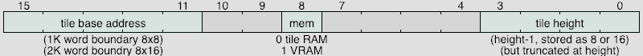
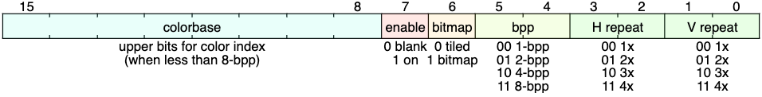

# Xosera - Xark's Open Source Embedded Retro Adapter

## Xosera Reference Information

Xosera has 16 16-bit bus accessable registers that are used to control its operation.  The even
and odd bytes in the word can be accessed independently.

Xosera's 128KB of VRAM is organized as 64K x 16-bit words, so a full VRAM address is 16-bits (and an
individual byte is not directly accessible, only 16-bit words).

### Xosera Video Modes

Xosera always outputs a fixed video resolution (either 640x480 or 848x480 widescreen at 60 Hz, and can be re-configured at run-time),
but it uses several different video generation modes and options to control how the display is generated.

| Mode  | Tile size | 640x480 (4:3)                | 848x480 (16:9)                  | Colors                                                |
--------|-----------|------------------------------|---------------------------------|------------------------------------------------------ |
| Text  | 8x16      | 80x30 tiles  2400 words | 106 x 30 tiles  3180 words | 2 from 16 color palette per tile using attribute byte |
| Text  | 8x8       | 80x60 tiles  4800 words | 106 x 60 tiles  6360 words | 2 from 16 color palette per tile using attribute byte |

Tile size can be 8x16 (4KB) or 8x8 (2KB) as stored, but can be truncated vertically when displayed (e.g., for 8x10).
There is 8KB font memory in 4 2KB banks (e.g. 2 8x16 fonts, or 1 8x16 font and 2 8x8 fonts).

Font/tile memory is writable in AUX address space (but not readable).
(Graphics modes coming soon...)

### Xosera 16-bit Registers

| Reg # | Name             | R/W/+ | Description                                                      |
--------| -----------------|-------| ---------------------------------------------------------------- |
| 0x0   | `XVID_AUX_ADDR`  | R/W   | AUX address for `AUX_DATA` read/write, set notes below
| 0x1   | `XVID_CONST`     | R/W   | set constant value (e.g. for VRAM fill) TODO
| 0x2   | `XVID_RD_ADDR`   | R/W   | set read address for reading from VRAM [Note 1]
| 0x3   | `XVID_WR_ADDR`   | R/W   | set write address for writing to VRAM
| 0x4   | `XVID_DATA`      | R/W/+ | read/write VRAM word at `RD`/`WR_ADDR` then add `RD`/`WR_INC`[Note X]
| 0x5   | `XVID_DATA_2`    | R/W/+ | 2nd`XVID_DATA`(to allow for 32-bit read/write) [Note X]
| 0x6   | `XVID_AUX_DATA`  | R/W/+ | read/write AUX word at `AUX_ADDR` [Note X]
| 0x7   | `XVID_COUNT`     | R/W/+ | write blitter count and start operation or read blitter status
| 0x8   | `XVID_RD_INC`    | W/O   | `RD_ADDR` increment per word read
| 0x9   | `XVID_WR_INC`    | W/O   | `WR_ADDR` increment per word write
| 0xA   | `XVID_WR_MOD`    | W/O   | `WR_ADDR` increment every `WIDTH` words read (in 2D mode)
| 0xB   | `XVID_RD_MOD`    | W/O   | `RD_ADDR` increment every `WIDTH` words write (in 2D mode)
| 0xC   | `XVID_WIDTH`     | W/O   | width in words for 2D rectangular blit
| 0xD   | `XVID_BLIT_CTRL` | W/O   | set blitter options see below
| 0xE   | `XVID_UNUSED_E`  |  --   | TODO TBD
| 0xF   | `XVID_UNUSED_F`  |  --   | TODO TBD

Registers 0x0 - 0x3 are fully read/write and have no "side effects" (except writing `RD_ADDR` will cause that address to be read from VRAM). Either byte can be written to in any order (the word at `VRAM[RD_ADDR]` will be read only when the odd byte/LSB of `RD_ADDR` is written, that word can be accessed via `XVID_DATA`/`2`).
Registers 0x4 - 0x7 have various special actions when read/written (e.g., write VRAM, read status or start blitter and AUX register effects).  The special actions only occur when the odd_byte/LSB is written.
Registers 0x8 - 0xF are write-only (reading them will alias other registers).

Since the registers are 16-bit words (with no individual byte access) and bus access is 8-bit, the even byte/MSB is saved upon write until the odd byte/LSB is written.  For registers 0-3 each byte of the register is updated when written. `DATA`/`DATA_2` share common odd byte/MSB storage that is be preserved.  All the other registers share even byte/MSB storage which is zeroed after the odd byte/LSB is written to and the entire word is updated atomically.

TODO `BLIT_CTRL`[0] enables 2-D blit mode (where `WIDTH` and `RD`/`WR_MOD` are used to blit rectangular areas)
TODO `BLIT_CTRL`[1] enables blit using `CONST` data value as source instead of reading VRAM.

The `BLIT_CTRL` also has bits that allow Xosera "re-configure" itself.  This will cause the FPGA to reload a configuration from flash memory (4 are selectable). Write the value 0x8x80 to `XVID_VID_CTRL` and Xosera FPGA will reconfigure itself, like at power on (VRAM will be clear and AUX memory will be reloaded).  Bits [9:8] will select the firmware to reconfigure to (normally, 0 for 640x480 mode, 1 for 848x480 mode with the other configs user defined).  The FPGA takes about 80-100 milliseconds to reconfigure and initialize (you can repeatedly write to a register (e.g., `XVID_CONST`) and wait until it reads back to know the FPGA has finished reconfiguring).

### AUX Memory Areas

| Name             | Address Range | R/W| Width          | Description                                                     |
|------------------| --------------|-----|---------------|-----------------------------------------------------------------|
| `AUX_VID_`*      | 0x0000-0x3FFF | R/W*| 16-bit [15:0] | AUX_VID register area, see below                                |
| `AUX_W_FONT`     | 0x4000-0x4FFF | W/O | 16-bit [15:0] | 8KB font/tile memory (4K words, high byte first for 8-bit font) |
| `AUX_W_COLORTBL` | 0x8000-0x80FF | W/O | 16-bit [15:0] | 256 word color lookup table (0xXRGB)                            |
| `AUX_W_AUD_`*    | 0xC000-0xFFFF |  -  |       -       | TODO TBD (audio registers?)                                     |

To access the AUX region, write the AUX address to `XVID_AUX_ADDR`, then write to `XVID_AUX_DATA`.

Each word written to `XVID_AUX_DATA` will also automatically increment `XVID_AUX_ADDR` (this allows faster consecutive writes, like for palette or font RAM update).  Note that this is not the case when reading `XVID_AUX_ADDR` (you _must_ write `XVID_AUX_ADDR` to trigger a read).

TODO Make font memory read/write (perhaps with restrictions/slow read while in use)

### Xosera AUX_VID Registers

This AUX region has registers that deal with video generation configuration and video status.

To access these registers, write the register address to `XVID_AUX_ADDR`, then read or write register data to `XVID_AUX_DATA`.  Note that some read-only registers overlap some write-only registers.

###### Read-Write AUX_VID Registers

| Reg # | Name                  |R/W| Description                                                                         |
--------| ----------------------|---| ------------------------------------------------------------------------------------|
| 0x0   | `AUX_DISPSTART`       |R/W| [15:0] starting VRAM address for display (wraps at 0xffff)                          |
| 0x1   | `AUX_DISPWIDTH`       |R/W| [15:0] words per display line                                                       |
| 0x2   | `AUX_SCROLLXY`        |R/W| [15:8] H pixel scroll, [4:0] V pixel scroll                                         |
| 0x3   | `AUX_FONTCTRL`        |R/W| [15:10] font addr bank,[7] 0=fontRAM/1=VRAM, [3:0] font height-1 (stored x8 or x16) |
| 0x4   | `AUX_GFXCTRL`         |R/W| [15:8] colorbase [7] disable video, [6] bitmap mode [5:4] bpp, [3:2] H repeat, [1:0] V repeat |
| 0x5   | `AUX_LINESTART`       |R/W| [15:0] VRAM address for next display line (reset to `DISPSTART` at start of frame)  |
| 0x6   | `AUX_LINEINTR`        |R/W| [15] scanline interrupt enable [10:0] interrupt scanline (e.g., 0-479)              |
| 0x7   | `AUX_SCREEN_WIDTH`    |R/W| [9:0] number of physical pixels of window width (e.g. 640)                          |

(This is a test of improved register diagrams, but not ideal on GitHub dark)

(Plan B test rendering register diagram to a white PNG, not ideal, but more readable)

(This is a test of improved register diagrams, but not ideal on GitHub dark)

(Plan B test rendering register diagram to a white PNG, not ideal, but more readable)

TODO The above registers most likely need to be multiplexed for "plane B" control (or maybe pack both here...🤔)

###### Read-only AUX_VID Registers

| Reg # | Name                  |R/W| Description                                                                         |
--------| ----------------------|---| ------------------------------------------------------------------------------------|
| 0x8   | `AUX_R_WIDTH`         |R/O| [15:0] configured display resolution width (e.g., 640 or 848)                       |
| 0x9   | `AUX_R_HEIGHT`        |R/O| [15:0] configured display resolution height (e.g. 480)                              |
| 0xA   | `AUX_R_FEATURES`      |R/O| [15:0] configured features [bits TBD]                                               |
| 0xB   | `AUX_R_SCANLINE`      |R/O| [15] in V blank (non-visible), [14] in H blank [10:0] V scanline (< HEIGHT visible) |
| 0xC   | `AUX_R_GITHASH_H`     |R/O| [15:0] high 16-bits of 32-bit Git hash build identifier                             |
| 0xD   | `AUX_R_GITHASH_L`     |R/O| [15:0] low 16-bits of 32-bit Git hash build identifier                              |
| 0xE   | `AUX_R_UNUSED_E`      |R/O|                                                                                     |
| 0xF   | `AUX_R_UNUSED_F`      |R/O|                                                                                     |
